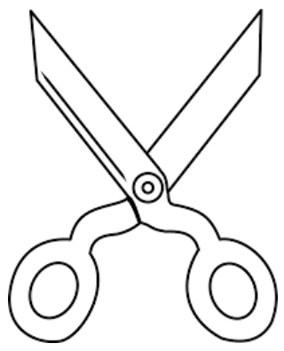

.. _l-api-video-audio:

Vidéos et Sons
==============

Cette série de fonctions sont des exemples d'utilisation du module
:epkg:`moviepy`. Celui-ci permet de faire du montage vidéo
en programmant avec :epkg:`Python`. C'est sans doute moins puissant
qu'un vrai logiciel de montage tel que :epkg:`ShotCut` ou :epkg:`OpenShot`.
La progrommation a néanmoins deux avantages. Elle permet de répéter
un traitement facilement pour construire une vidéo. Elle peut opérer
la même opération sur chaque image d'un image comme l'extraction
des personnages du film (voir :ref:`imagemarypoppinsrst`).
Il est parfois plus simple de programmer plutôt que d'apprendre
à se servir d'un logiciel qui propose une interface utilisateur
pas toujours intuitive (lire aussi
:ref:`Montage vidéo avec Python <b-montage-video-2018>`.

.. contents::
    :local:

Les fonctions sur les vidéos commencent quasiment toutes par le même
paramètre :*video_or_file*. Celui-ci peut soit être un nom de fichier,
soit un objet de type :epkg:`VideoClip`. Un exemple :

::

    from code_beatrix.faq.faq_video import video_concatenate, video_save

    new_video = video_concatenate(["video1.mp4", "video2.avi"])
    video_save(new_video)

Un autre exemple où la première vidéo est un extrait d'une vidéo :

::

    from code_beatrix.faq.faq_video import video_concatenate, video_save

    v1 = video_extract_video("video1.mp4", '00:00:01.45', '00:00:010.51')
    new_video = video_concatenate([v1, "video2.avi"])
    video_save(new_video)

La même logique s'applique aux sons. Les fonctions qui suivent
couvrent un petit sous-ensemble de ce qu'il est possible de faire
avec le module :epkg:`moviepy`. Pour aller plus loin, il peut être
utile de s'inspirer du code de celles-ci et de regarder
les `exemples de la documentation <https://zulko.github.io/moviepy/examples/examples.html>`_.
Le notebook :ref:`video_notebook` montre comment insérer
un texte qui défile et comment le voir facilement dans un notebook.
Il faut voir ces fonctions comme des outils pour agir sur une pellicule,
des ciseaux, de la colle...

Audio
+++++

.. autosignature:: code_beatrix.faq.faq_video.audio_compose

.. autosignature:: code_beatrix.faq.faq_video.audio_concatenate

.. autosignature:: code_beatrix.faq.faq_video.audio_extract_audio

.. autosignature:: code_beatrix.faq.faq_video.audio_modification

.. autosignature:: code_beatrix.faq.faq_video.audio_save

Video
+++++

La fonction :func:`video_compose <code_beatrix.faq.faq_video.video_compose>`
assemble plusieurs vidÈo en mÍme temps. Le paramËtre *place* permet
de choisir une configuration dÈj‡ implÈmentÈe comme la juxtaposition de
deux vidÈos cÙte ‡ cÙte horizontalement ou verticalement.

.. autosignature:: code_beatrix.faq.faq_video.video_compose

.. autosignature:: code_beatrix.faq.faq_video.video_concatenate

.. autosignature:: code_beatrix.faq.faq_video.video_enumerate_frames

.. autosignature:: code_beatrix.faq.faq_video.video_extract_audio

.. autosignature:: code_beatrix.faq.faq_video.video_extract_video

.. autosignature:: code_beatrix.faq.faq_video.video_frame

.. autosignature:: code_beatrix.faq.faq_video.video_image

.. autosignature:: code_beatrix.faq.faq_video.video_modification

.. autosignature:: code_beatrix.faq.faq_video.video_position

.. autosignature:: code_beatrix.faq.faq_video.video_remove_audio

.. autosignature:: code_beatrix.faq.faq_video.video_replace_audio

.. autosignature:: code_beatrix.faq.faq_video.video_save

.. autosignature:: code_beatrix.faq.faq_video.video_text

YouTube
+++++++

.. autosignature:: code_beatrix.faq.faq_video.download_youtube_video
