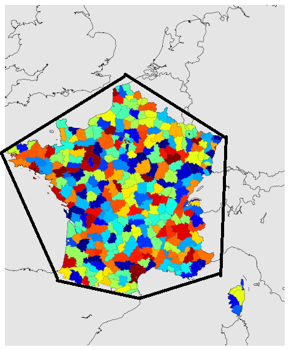
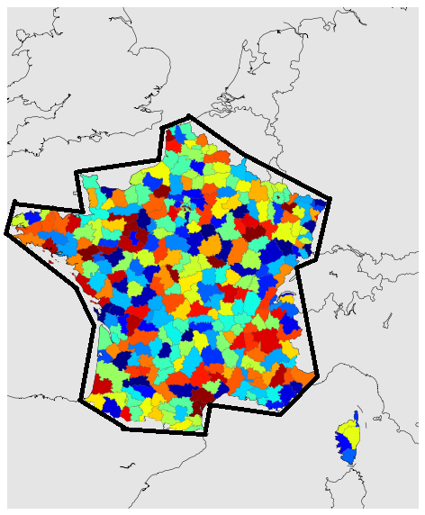
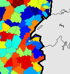
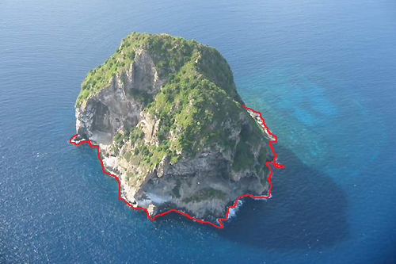
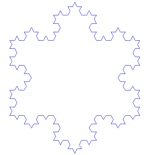

.. index:: solution, mathématiques, fractale

.. _l-maths_fractales_sol:

Quel est la longueur du périmètre de la France ? (solution)
===========================================================

Les fractales
-------------

Le périmètre de la France est infini mais sa surface l'est.
C'était la conclusion de la petite digression que je me suis
permis lors du dernier coding gouter. Si on le laisse de côté le
phénomène des marées qui complique un peu les choses, il est assez
facile de parcourir le bord de France avec des tiges d'une longueur
d'un kilomètre pour entourer maladroitement le pays.

Et si maintenant, on cassait une tige 10 en petits bouts de 100 mètres
pour aller au plus près de la côte. Il nous manquerait
un peu de longueur pour finir. Mais combien ?

Si on redécoupe en 10 ?

A chaque fois, le périmètre paraît plus grand. Et on peut continuer comme ça jusqu'à atteindre
le moindre rocher sur la plage.

On s'aperçoit également que l'épaisseur du trait a son importance, plus le fil
utilisé pour entourer la France est fin, plus ou pourra cerner la moindre enfractuosité du rivage.
C'est un peu cela qui caractérise le pérmimètre. Il est impossible d'en calculer la longueur.
En revanche, si on choisit l'épaisseur de la corde qu'on utilise pour entourer la France,
on sait qu'on ne pourra pas distinguer les détails plus petits que l'épaisseur de la corde.
C'est `Benoît Mandelbrot <https://en.wikipedia.org/wiki/Benoit_Mandelbrot>`_ qui a développé
la théorie des fractales et celle-ci dit (en l'adaptant) :

    Si on mesure le périmètre *p(e)* de la France obtenu avec une épaisseur de corde
    précise *e*, celui-ci tend vers l'infini lorsque l'épaisseur tend vers 0.

Pour s'en convaincre, on peut construire une figure célèbre en forme d'étoile :
le `flocon de Koch <https://fr.wikipedia.org/wiki/Flocon_de_Koch>`_.

On part d'un triangle équilatéral dont on coupe chaque côté en trois.

.. image:: https://upload.wikimedia.org/wikipedia/commons/0/04/Droite_Koch.png
    :alt: image extraite de Wikipédia

A chaque tour, on multiplie la longueur par 4/3.
L'étoile finale tient dans un cercle, sa surface ne peut pas dépasser ces limites
mais son périmètre devient infini. Bien sûr, à partir d'un certain moment,
les yeux ne distinguent plus les petits détails. On zoome pour retrouver
quasiment la même chose si bien qu'on ne sait plus vraiment
à quelle échelle une photo a été prise.

Digressions
-----------

Avez-vous déjà penser à mesurer le volume d'air que peut contenir vos poumons ?
Facile, il suffit de souffler dans un ballon. Et puis au collège, on apprend que
les poumons apporte de l'oxygène au sang et que ce qui est important, ce n'est pas
forcément le volume mais la surface de contact entre l'air et le sang.
Mais comment fait-on pour mesurer un truc pareil ? Difficile...
Les poumons ressemblent beaucoup à des fractales. Il y a aurait 23 niveaux de bifurcations
(d'après `Le poumon, une fractale quasi-optimale <http://www.breves-de-maths.fr/le-poumon-une-fractale-quasi-optimale/>`_),
un peu comme celle du flocon de Koch. A partir de là, on peut essayer de construire
la fractale qui s'approche le plus possible de la structure des poumons et avoir
une idée de l'augmentation de la surface.

Le cours d'histoire entre la sixième et le lycée revient parfois sur les mêmes périodes
historiques. Des détails supplémenaires viennent compléter la première visite, un peu comme
si vous regardiez une peinture d'un peu plus près. L'histoire qu'on vous enseigne
devient un peu plus complexe. Une fois que vous avez quitté l'école,
vous lisez un livre sur la même période de l'histoire. De nouveaux personnages apparaissent,
un gérant d'usine, un petit inventeur, la femme d'un banquier. L'histoire **se ramifie**.
Ce terme rappelle fortement le flocon de Koch auquel on ajoute une couche.

Bibliographie
-------------

* `Une approche fractale des marchés <http://www.odilejacob.fr/catalogue/sciences-humaines/economie-et-finance/une-approche-fractale-des-marches_9782738122643.php>`_,
  Benoît Mandelbrot
* `Les fractales pour les nuls <http://brunomarion.com/fr/les-fractales-pour-les-nuls/>`_
* `Mandelbulber logiciel pour générer des fractales <http://logiciels-gpl.blogspot.fr/2014/03/mandelbulder-logiciel-pour-generer-des.html>`_
* `Mandelbulber <http://www.mandelbulber.com/>`_, vous n'allez plus regarder
  `Matrix <https://en.wikipedia.org/wiki/The_Matrix>`_ de la même manière
* `14 amazing fractals found in nature <http://www.mnn.com/earth-matters/wilderness-resources/blogs/14-amazing-fractals-found-in-nature>`_
