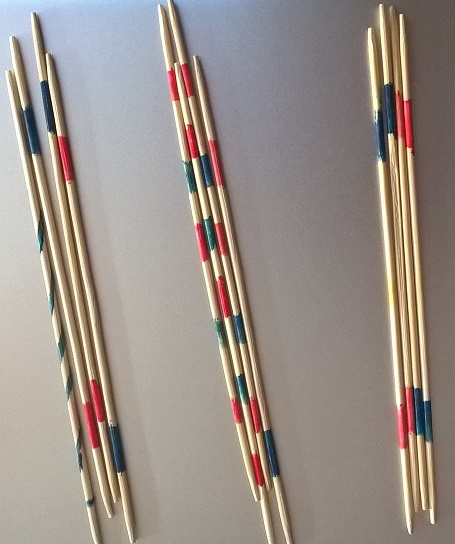
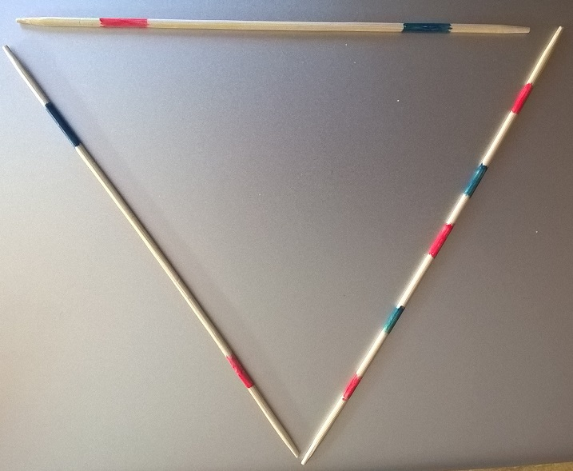

.. index:: énoncé, mathématiques, nombre premier

.. _l-maths_nombre_premier:

Les paquets de Mikado
=====================

A partir de 6 ans.

Les nombres premiers ne sont pas une notion
facile à comprendre mais il est plus facile
d'expliquer que 11 mikado ne peuvent pas être
regrouper sous forme de paquets.

Mise en scène
-------------

Il faut commencer par une partie de mikados et compter le nombre
bâtons gagnés à la fin de la partie. J'ai tendance à regrouper
les tiges par paquets de cinq pour les compter. Reste à expliquer
pourquoi on fait moins d'erreurs en procédant comme cela.
Ensuite, on peut se poser la question : est-il possible de diviser 21
tiges en 3 paquests ayant le même nombre de Mikado chacun.
Voici quelques questions :

* Prendre 12 mikados et demander 3 paquets identiques puis 4 paquets identiques.
* Prendre 14 mikados et demander 2 paquets identiques puis 7 paquets identiques.
* Comment faire des paquets identiques sans se tromper ?
* Est-ce qu'on peut faire des paquets identiques avec 9 mikados, puis 11 ?

On peut alors passer à la géométrie et dessiner des
triangles, des carrés, des hexagones, des étoiles
et demander des questions telles que :

* Avec 5 mikados, comment faire deux triangles ?

Il est possible aussi de dessiner une figure
sur une feuille de papier puis de demander de
la faire en mikados.

Solution
--------

Voir :ref:`l-maths_nombres_premiers_sol`.

A quoi ça sert ?
----------------

Il n'est pas besoin de jeux très compliqués en vacances.
Le premier objectif est d'expliquer comment compter sans
se tromper un grand nombre d'éléments tels que des mikados
en les regroupant en paquets de 5 ou 10.
Pour la géométrie, c'est un pas vers la construction de cabanes.
