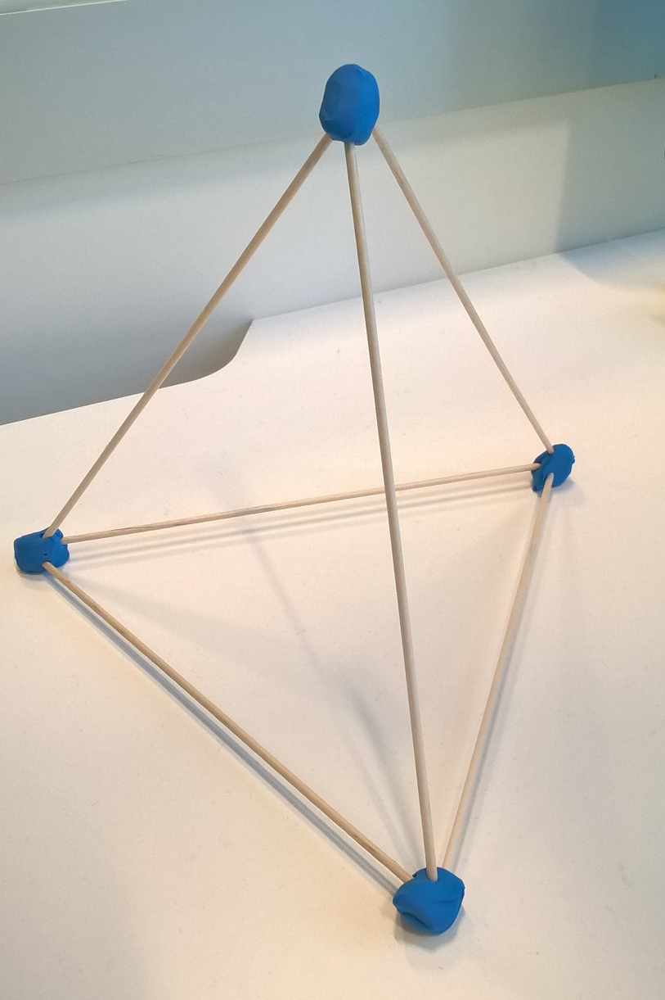

.. index:: énoncé, mathématiques, solide régulier

.. _l-maths_solides:

Combien de solides réguliers dans l'espace ?
============================================

A partir de 8 ans.

Un solide régulier ou plus précisément
`Polyèdres réguliers <https://fr.wikipedia.org/wiki/Poly%C3%A8dre_r%C3%A9gulier>`_
est un volume géométrique dont les arêtes ont toutes la même longueur, les faces
ont toutes la même forme et chaque sommet est relié au même nombre de faces.
Le cube est l'un deux. La pyramide également. Mais combien sont-ils ?
Une infinité ou juste quelques-uns ?

Mise en scène
-------------

Pour bien comprendre il faut utiliser de la pâte à modeler, des cures-dents ou des mikados,
pour former une pyramide, un cube... un peu comme sur la photo qui illustre l'article
du Parisien (23/04/2016) :
`A Issy, les collégiennes passent leurs vacances en "colo" numérique <http://www.leparisien.fr/issy-les-moulineaux-92130/a-issy-les-collegiennes-passent-leurs-vacances-en-colo-numerique-22-04-2016-5737487.php>`_.

*Indications :*

* Un sommet est rattaché à combien de faces au minimum ?
* On peut construire un polyèdre régulier avec des triangles, des carrés, des pentagones, des hexagones, des heptagones ?

Solution
--------

Voir :ref:`l-maths_solides_sol`.

A quoi ça sert ?
----------------

Avez-vous déjà observé un `ballon de football <https://fr.wikipedia.org/wiki/Ballon_de_football>`_ ?
Ce n'est pas seulement une balle qu'on gonfle mais
un ensemble d'hexagones et de pentagones cousu ensemble pour former
l'enveloppe de cuir qui protège l'enveloppe gonflable.
Pourquoi ne peut-on pas coudre des petits bouts de cuir tous de la même forme ?
La réponse est ci-dessus.
