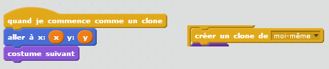
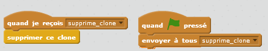
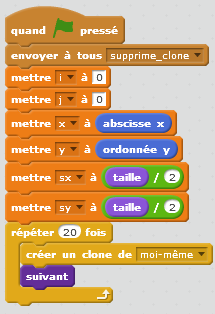

.. index:: énoncé, dessin, pyramide, scratch, programmation

.. _l-prog_dessin_pyramide:

Construire une pyramide de balles
=================================

A partir de 7 ans. 

L'objectif de l'exercice est de dessin un motif, une pyramide dans ce cas, avec un programme.
Il faut bien comprendre comme le motif se répète.

Mise en scène
-------------

L'objectif est de dessiner la pyramide suivante avec Scratch :

Bien sûr, on ne veut pas le faire à la main. 
Comme on n'est pas magicien, on n'a pas le pouvoir de les faire 
apparaître tout en même temps mais une par une.

**Q1 :** Est-il plus facile de commencer par en haut (la pointe)
ou par en bas (la base ?)

**Q2 :** Si on fait apparaître les balles une à une,
comment les numéroter ? 

**Q3 :** Après coup, on s'aperçoit que numéroter les billes comme ça n'est pas évident pour la suite.
On préfèrerait les numéroter avec deux nombres qui indiquerait plus facilement leur position 
dans l'image ? Que proposez-vous ?

Quelques précisions sur Scratch
-------------------------------

Pour faire appraître autant de balles qu'on veut comme par magie,
il faut utiliser les clones :

L'instruction de droite fait apparaître un clone, celle de gauche dit 
ce qu'il faut faire lorsqu'elle celui-ci apparaît. L'inconvénient
majeur de ce système est qu'après plusieurs exécutions,
l'écran contient une multitude de clones. Il faut donc les supprimer
au début de chaque exécution. Pour ce faire, on envoie un message
*supprime_clone* à tous les clones qui doivent disparaître lorsqu'ils le reçoivent.

Ensuite, afin de ne pas trop hésiter au début du programme, il paraît
difficile d'éviter l'utilisation des variables.

Parmi les six variables créées, deux ne changent jamais *sx*, *sy*, 
elles représentent la taille des balles. 

**Q4 :** Mais pourquoi avoir créé deux variables *i*, *j* qui augmentent de 1 en 1
et deux autres *x*, *y* qui augmente de *sx* et *sy* ?

Exercice 1
----------

Il ne reste plus qu'à terminer le programme avec Scratch. On pourra compléter
le projet suivant :    
:download:`echiquier0.sb2 <../../../../src/code_beatrix/scratchs/example_echiquier/echiquier0.sb2>`. 

Exercice 2
----------

Et si maintenant, on essayait de faire ceci :

.. image:: ../blog/2015/biodiversite_tri.png

Il faudra bien évidemment que la balle clonée change de costume.
*Petite astuce :* parmi les opérations proposées par Scratch, 
n'y en aurait-il pas qui vous sont peut-être inconnues mais 
qui vous seraient très utiles dans ce cas précis ?
    

Solution
--------

Voir :ref:`l-prog_dessin_pyramide_sol`.

A quoi ça sert ?
----------------

Cet exercice est assez semblable à celui proposé dans
:ref:`l-prog_parcours_echiquier`. Il faut décrire de façon précise
le parcours d'une pyramide. 
Ces façons de faire nous paraissent plutôt évidente. 
Pourtant, leur traduction en un programme informatique
l'est un peu moins. A quoi pensait 
`Descartes <http://fr.wikipedia.org/wiki/Ren%C3%A9_Descartes>`_ 
quand il a inventé le 
`système cartésien <http://fr.wikipedia.org/wiki/Coordonn%C3%A9es_cart%C3%A9siennes>`_ ?
Programmer, c'est un peu penser en cartésien et un peu moins en géométrique.