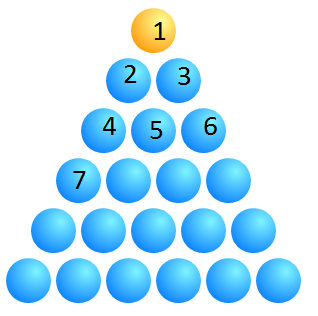
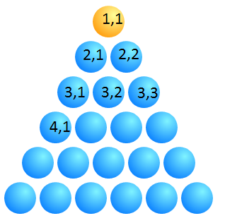
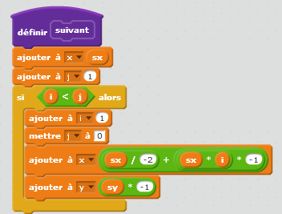
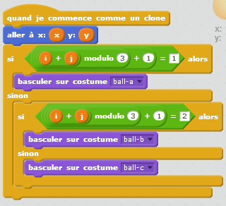

.. issue.

.. index:: solution, dessin, pyramide, scratch, programmation

.. _l-prog_dessin_pyramide_sol:

Construire une pyramide de balles (solution)
============================================

**Q1 :** 

Il est plus facile de commencer par le haut et de fait grandir la pyramide
jusqu'en bas. De cette façon, on peut créer des pyramides aussi grandes qu'on veut.
Dans l'autre sens, la taille de la base détermine la taille finale de la pyramide
avant qu'on l'ait terminée.

**Q2 :** 

D'après la question précédente, il est préférable de commencer par le haut.
La premier balle porte le numéro 1 et est celle du haut. Ensuite,
un continue la numérotation en parcourant chaque ligne.

De cette façon, on peut toujours agrandir la pyramide.
Ce n'est pas le cas si on part vers le bas pour numéroter.

**Q3 :** 

Le numéro de chaque balle n'indique pas sur quelle ligne elle se
trouve. On va s'en changer cela.

**Q4 :** 

Lorsqu'on regarde la seconde numérotation de chaque balle, on s'aperçoit
que le premier numéro indique la ligne, le second la position de la balle
sur cette ligne. Le problème est que ces deux nombres simples n'ont aucun
rapport avec la position de la balle dans l'écran de Scratch. 
C'est pour cela qu'on fait la distinction entre la numérotation à deux chiffres
de la balle et ses coordonnées sur l'écran de Scratch.
Si on note :math:`x_0` et :math:`y_0`, on obtient comme relation entre les deux :

.. math::
    
    x = x_0 + j * sx + i * sx/2 
    
    y = y_0 - i * sy 

Passer d'un système de numérotation (donc des coordonnées) au système
de coordonnées de l'écran n'est pas toujours évident.

Exercice 1
----------

L'astuce est de remarquer que, sur la ligne 1, il y a une balle,
sur la ligne 2, il y a deux balles, et ainsi de suite :
sur la ligne *i*, il y *i* balles.

La solution est illustrée par :

Et le programme à exécuter est le suivant :
:download:`pyramide.sb2 <../../../../src/code_beatrix/scratchs/example_pyramide/pyramide.sb2>`.
    

Exercice 2
----------

L'article :ref:`b-biodiversite`fait référence à cet exercice.
Il utilise le programme Scratch suivant pour dessiner des balles
de couleurs différentes selon un motif précis.

L'astuce consiste à changer de costume tous les trois arbres au fur et à mesure qu'on les pose :
on commence par le costume *a*, puis *b*, puis *c*. Ensuite, on recommence à *a*, *b* et 
ainsi de suite.

.. index:: modulo

C'est un petit tour de passe passe qu'on utilise souvent en mathématique : on 
considère les nombres 1, 2, 3, 4, 5, 6, ... et on s'intéresse au reste de la division
de chaque nombre par trois : reste de 1/3 = 1, reste de 2/3 = 2, reste de 3/3 = 0, 
reste de 4/3 = 1, reste de 5/3 = 2, reste de 6/3 = 0... 

On appelle cette opération le 
`modulo <http://fr.wikipedia.org/wiki/Modulo_%28op%C3%A9ration%29>`_
et cette opération existe en Scratch :

Pour voir la correction en entier, il suffit de télécharger le fichier :
:download:`pyramide_bio.sb2 <../../../../src/code_beatrix/scratchs/example_pyramide/pyramide_bio.sb2>`.

