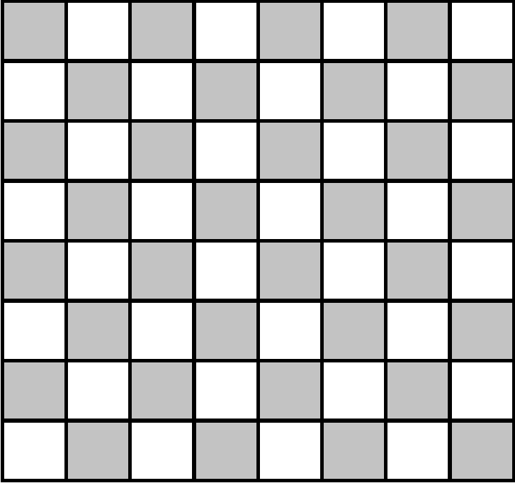
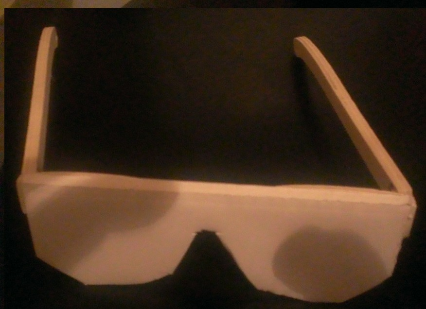

.. issue.

.. index:: énoncé, échiquier, parcours, variable, Dunkerque 2015-03-25, scratch, python

.. _l-prog_parcours_echiquier:

Parcours d'un échiquier
=======================

A partir de 7 ans. 

L'objectif de l'exercice est de découvrir que pour décrire un algorithme,
il faut être très précis. C'est pourquoi on a inventé les langages informatiques.

Mise en scène
-------------

#. On dispose un échiquier.
#. Il y a trois personnes.
#. On cache les yeux du troisième.
#. La première personne prend un pion et parcourt avec ce pion 
   toutes les pièces de l'échiquier devant le
   la seconde personne, de la manière de son choix (pas trop compliquée quand même).
#. La seconde personne explique à la troisième ce qu'elle a vu, 
   celle-ci a toujours les yeux bandés.
#. On enlève le bandeau.
#. La troisième personne doit reproduire ce qu'a fait la première à partir
   de ce qu'on lui a expliqué.

    
Il faut aussi des lunettes magiques :

    
On recommence avec d'autres façons de parcourir l'échiquier.

Questions
---------

#. Lors des différentes description de parcours proposées, y a-t-il des répétitions ?
#. Est-il possible de prendre n'importe quelle parcours 
   et de reformuler sa description avec les trois instructions :
   
   * répéter *n* fois,
   * avancer d'une case dans une direction (droite, gauche, haut, bas),
   * sauter à une case précise ?
   
#. Peut-on choisir un parcours et donner la liste ordonnées des cases parcourues ?
#. Quelle votre description de parcours préférée ?

Exercice 1
----------

Il faut programmer un des parcours de l'échiquier 
avec `Scratch <https://scratch.mit.edu/>`_. 
On pourra compléter ce projet 
:download:`echiquier0.sb2 <../../../../src/code_beatrix/scratchs/example_echiquier/echiquier0.sb2>`.

Exercice 2
----------

On repère chaque case de l'échiquier par son numéro de ligne et son numéro de colonne 
(en commançant à 0 et non pas 1).
Pour chaque case, on calcule ::

    (numéro de ligne) * 8 + numéro de colonne
    
#. On calcule de nombre pour chaque case. Y-a-il des cases qui portent le même numéro ?
   Comment décrire le trajet d'un pion qui parcourt tous les cases dans le sens croissant
   des numéros ?
#. Donner une formule qui correspond au parcourt suivant ?
   Les numéros ne doivent pas forcément être contigüs.

.. image:: parcours_diag.png

Solution
--------

Voir :ref:`l-prog_parcours_echiquier_sol`.

A quoi ça sert ?
----------------

Avez-vous jamais perdu quelque chose dans votre maison, votre téléphone, vos clés... que sais-je encore ?
Comment cherchez-vous ce que vous avez perdu ? Mentalement, on effectue un parcours de sa propre maison
pour ne pas chercher deux fois au même endroit.

