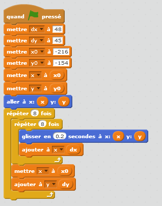


.. issue.

.. index:: solution, échiquier, parcours, variable

.. _l-prog_parcours_echiquier_sol:

Parcours d'un échiquier (solution)
==================================

Solution de :ref:`l-prog_parcours_echiquier`.

Questions
---------

#. Sauf si le parcours est tout-à-faire aléatoire, il y aura des répétitions. 
   Par exemple, répéter 8 fois : avancer d'une case vers la droite.

#. On considère le parcours suivant qui consiste à parcourir toutes les lignes de gauche à droite
   et de bas en haut :

   .. image:: echiquier_parcours1.png
      :width: 300 px
      
   On le décrit comme suit :
        * Répéter 8 fois pour toutes les lignes de bas en haut
            * Aller au début de la ligne
            * Répéter 8 fois, avancer d'une case vers la droite
        
#. La première étape consiste à nommer chaque case. 
   On reprend la désignation courante d'un `échiquier <http://fr.wikipedia.org/wiki/%C3%89chiquier>`_ ::
   
        A1 B1 C1 D1 E1 F1 G1 H1
        A2 B2 C2 D2 E2 F2 G2 H2
        ...
        A8 B8 C8 D8 E8 F8 G8 H8
        
   Si on remplace les lettres par des nombres puis on enlève 1, cela donne ::

        0,0  1,0  2,0  3,0  4,0  5,0  6,0  7,0
        0,1  1,1  2,1  3,1  4,1  5,1  6,1  7,1
        ...
        0,7  1,7  2,7  3,7  4,7  5,7  6,7  7,7
        
#. Donner la liste des cases dans l'ordre de parcours est assez long et surtout 
   difficile à retenir car il n'y a pas de logique. Le fait d'avoir une règle qui dit
   comment parcourir les cases permet de retenir plus facilement et c'est beaucoup plus court.
   La description à l'aide des termes *répéter*, *avancer*, *sauter* n'est pas toujours évidente non plus.
   Si ces termes n'apparaissent pas trop souvent, ce n'est pas trop difficile mais si le parcours
   est complexe, on a souvent besoin de regrouper certains blocs. Par exemple, que préférez-vous ?
        * avancer 8 fois vers la droite,
        * ou parcourir la ligne de gauche à droite.
   **Conclusion :** on ne sait pas retenir facilement une liste de d'actions trop longue. Il faut faire
   apparaître des blocs logiques.

Exercice 1
----------

Le programme scratch :download:`parcours 1 <../../../../src/code_beatrix/scratchs/example_echiquier/echiquier.sb2>`
reproduit un parcours de l'échiquier
toujours de gauche à droite en partant des lignes du bas pour 
remonter jusqu'à la première ligne.

Les variables *x* et *y* prennent tour à tour les positions décrites lors de la 
question 3 du paragraphe précédent.

Exercice 2
----------

Lorsqu'on numérote toutes les cases en appliquant la formule ::

    (numéro de ligne) * 8 + numéro de colonne
    
Cela donne ::

      56  57  58  59  60  61  62  63
      48  49  50  51  52  53  54  55
      40  41  42  43  44  45  46  47
      32  33  34  35  36  37  38  39
      24  25  26  27  28  29  30  31
      16  17  18  19  20  21  22  23
       8   9  10  11  12  13  14  15
       0   1   2   3   4   5   6   7

Ce parcours correspond à celui décrit lors de la question 2 ::

  105   98   91   84   77   70   63   56
   97   90   83   76   69   62   55   48
   89   82   75   68   61   54   47   40
   81   74   67   60   53   46   39   32
   73   66   59   52   45   38   31   24
   65   58   51   44   37   30   23   16
   57   50   43   36   29   22   15    8
   49   42   35   28   21   14    7    0 

Et la formule qui a permis de le construire ::

    (numéro de ligne - numéro de colonne) * 8 + numéro de colonne + 49
    
Et le programme python ::

    row = []
    for i in range(0,8):
        s = ""
        for j in range(0,8):
            x = (i-j)*8 + j + 49
            s += "  %03d" % x 
        row.append(s)
    row.reverse()
    print("\n".join(row))
        
Pour obtenir le parcours, il suffit de trier les cases de l'échiquier en les classant
selon les valeurs croissantes de la formule.

.. _l-variable_combien:

Combien vaut une variable ?
---------------------------

Lorsqu'on se sert de Scratch, on voit d'un côté un dessin qui représente un programme,
de l'autre une animation. D'un côté, le scénario, de l'autre, le film. 
Quand on pose la question : combien vaut la variable *x* ?
Il est impossible de répondre si on n'arrête pas le film, il faut le mettre en pause.
A ce moment, on peut regarder combien vaut la variable *x*. Mais à l'instant d'après,
dès que le film se remet en marche, sa valeur change.

On ne se pose pas la question quand on voit le compte à rebours d'une bombe.
Que vaut-il ? Il reste cinq secondes, quatre, trois, ... Une variable,
même si on ne la voit pas, fonctionne de la même manière : ça bouge
tout le temps mais ça donne une information précise au moment où on la consulte.

