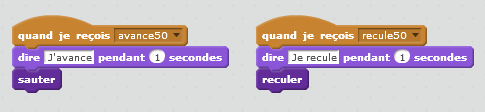

.. index:: énoncé, tri, scratch

.. _l-prog_tri:

Réaliser un tri sous Scratch
============================

A partir de 10 ans.

L'objectif de l'exercice est d'implémenter un tri avec Scratch
et ainsi de découvrir qu'un programme Scratch ne fonctionne pas
tout-à-fait pareil qu'un programme Python. La difficulté
est de faire en sorte que le tri soit accompagnée d'une animation avec
des personnages qui jouent à saute-mouton.

La mise en scène est très réduite car c'est un exercice plutôt solitaire
à moins de se partager un grand écran.

Trier un tableau sous scratch
+++++++++++++++++++++++++++++

.. _s-tri_bulle_wiki:

L'algorithme à implémenter est le `tri à bulle <http://fr.wikipedia.org/wiki/Tri_%C3%A0_bulles>`_
qui est abordé d'un point de vue algorithmique par cet :ref:`énoncé <s-tribulle>`
(et sa :ref:`correction <s-tri_bulle_sole>`). Je reproduis ici la description
de l'algorithme donnée par wikipedia : ::

    procédure tri_bulle(tableau t)
        n = longueur(t)
        pour i allant de n-1 à 1 pas -1 faire
             pour j allant de 1 à i pas 1 faire
                 si (t[j] > t[j+1]) alors
                      tmp = t[j]
                      t[j] = t[j+1]
                      t[j+1] = tmp
                 fin si
             fin pour
        fin pour
    fin procédure

Tout d'abord on plante le décor avec le
tableau à trier :

Les personnages qui vont jouer à saute-mouton :

Et les voilà qui jouent à saute-mouton :

Pour cet exercice, il suffit de compléter le projet
:download:`bubble_sort0.sb2 <../../../../src/code_beatrix/scratchs/example_tri/bubble_sort0.sb2>`.
Les images ci-dessus sont extraites de ce projet. Il ne reste plus qu'à implémenter le
tri dans le code du premier personnage.

Le projet n'est pas vide. Chaque personnage saute et revient en arrière
lorsqu'on clique sur lui excepté le premier. Lorsqu'on clique dessus,
il replace tous les objets à leur position initiale.

Avant de commencer, il faut expliquer une astuce qui permet de faire bouger les
personnages. Chacun à sa vie propre : en langage informatique, on dit
qu'ils ont chacun leur `thread <http://fr.wikipedia.org/wiki/Thread_%28informatique%29>`_.
Sous Scratch, il est facile de les faire rebondir, de détecter les collisions,
mais de les faire réagir avec un tableau... C'est plus difficile.

L'idée est de s'occuper de trier le tableau. Lorsque celui-ci change,
on envoie un message à tous les personnages et ceux-ci réagissent
ou non en le recevant. Par exemple, voici les deux actions
qu'un personnage effectue lorsqu'il reçoit les messages *avance50*, *recule50*
(50 étant la valeur du tableau à déplacer).

Chaque personnage s'attend à recevoir deux messages différents
pour chaque personnage car chacun représente une valeur différente
du tableau.

Trier un tableau sous scratch, version 2
++++++++++++++++++++++++++++++++++++++++

J'attendrai les prochaines versions de Scratch pour la réaliser.
L'inconvénient aujourd'hui est qu'a priori, on peut détecter qu'un personnage
en a touché un autre en particulier. On peut savoir si le chat
a touché le ballon. Mais s'il y a deux ballons, on ne peut pas
demander si le chat a touché un des deux ballons et demander
quel ballon a été touché. Quand cela sera possible... alors j'ajouterai
une seconde solution.

Solution
--------

Voir :ref:`l-prog_tri_sol`.

A quoi ça sert ?
----------------

Tous les langages de progammation (excepté Scratch) ont une fonction
qui trie les éléments d'un tableau. Alors pourquoi ?

Dans certaines configurations, il est préférable de reprogrammer son propre tri
car il sera plus rapide qu'une fonction toute faite simplement
parce qu'on a une information qu'on peut utiliser alors que la fonction
standard ne le peut pas.

Par exemple, si on doit trier un tableau dont 90% des valeurs sont égales à 0
et que toutes les autres valeurs sont strictement positives. On peut s'en servir
pour accélérer le tri.
