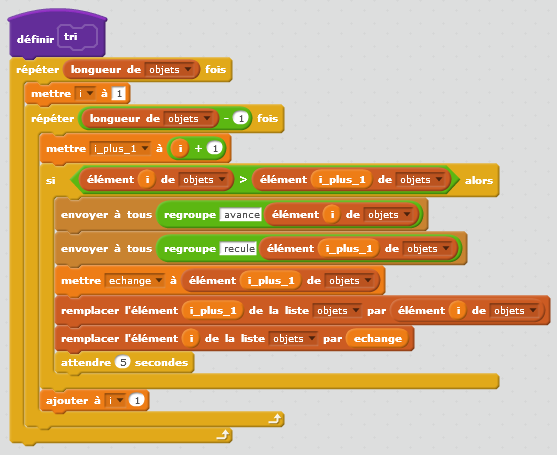
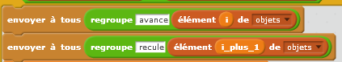
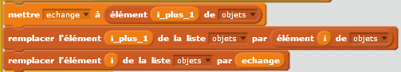


.. issue.

.. index:: solution, tri, scratch

.. _l-prog_tri_sol:

Réaliser un tri sous Scratch (solution)
=======================================

A partir de 10 ans. 

Trier un tableau sous scratch
+++++++++++++++++++++++++++++

La solution peut être trouvée dans le code du premier personnage du projet 
:download:`bubble_sort.sb2 <../../../../src/code_beatrix/scratchs/example_tri/bubble_sort.sb2>`.

Ce code est la traduction de l'algorithme
décrit par :ref:`wikipedia <s-tri_bulle_wiki>`.
On trouve les deux boucles, le test qui définit
quand deux éléments doivent être échangés, soit deux parties.

La première envoie des messages aux personnages pour leur dire 
de prendre les positions correspondant à celle du tableau une fois
celui-ci modifié.

La seconde échange deux valeurs du tableau. En informatique, il n'existe pas
toujours de fonction toute prête pour échanger. Il faut alors le faire soi-même.
Echanger deux valeurs d'un tableau revient à échanger les contenus de deux tiroirs :

#. il en faut en troisième où on met d'abord le contenu du premier tiroir,
#. ensuite on déplace le contenu du second tiroir dans le premier,
#. enfin on remet contenu du troisième tiroir (en fait l'ancien premier) dans le second tiroir.
