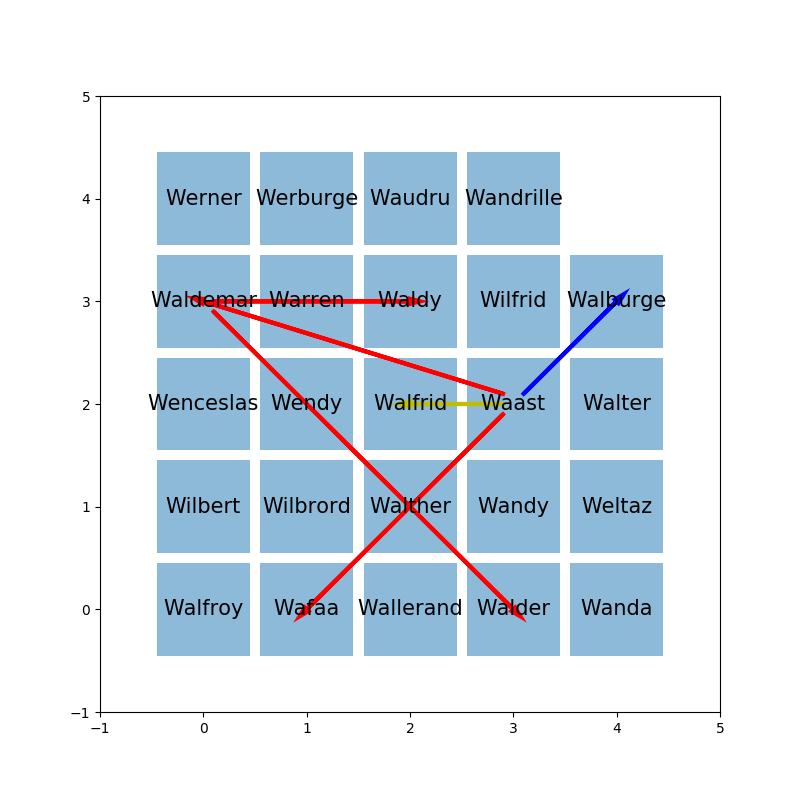
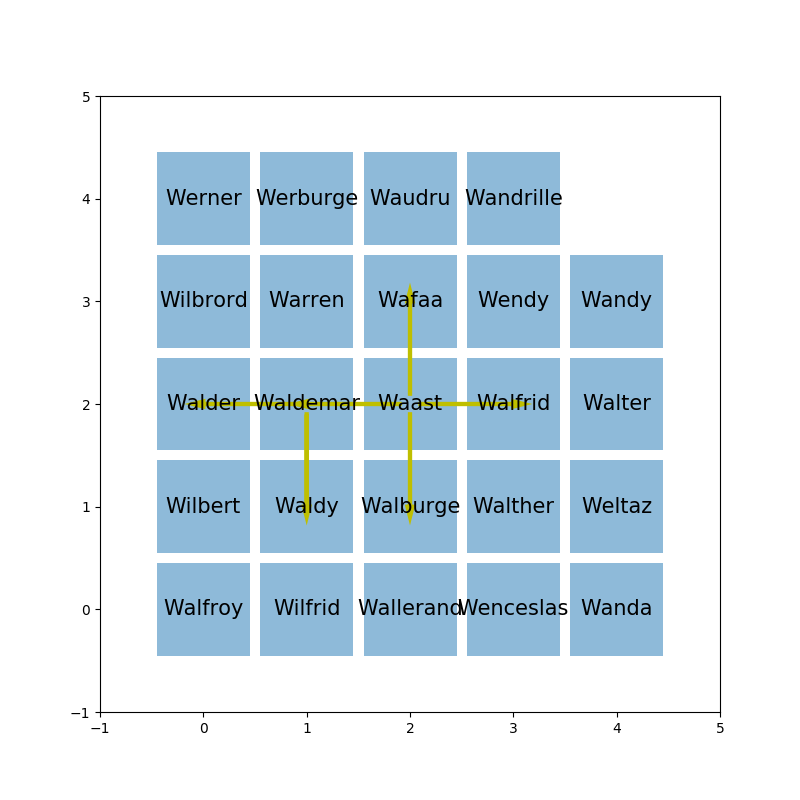

.. index:: voisin amis

.. _l-prog_voisin_amis:

Les chaises chaotiques
======================

A partir de 5-6 ans (mais ce n'est qu'une indication).

Comment choisissez-vous votre place dans la salle de classe ?
Vous est-elle assignée ? Voulez-vous vous trouver à côté de vos amis ?
Comment trouver la disposition qui contente le plus de monde ?

Mise en scène
-------------

La scène se passe dans une salle de classe. Chaque pair d'amis
est reliée par un élastique. Tout se place comme il veut tout en maintenant 
les élastiques. Une fois que tout le monde est placé, comment améliorer 
la situation ? Voici une situation de départ :

Les traits rouges sont des amis éloignés, les traits bleus
sont un peu moins éloignés, et les amis jaunes sont plutot 
satisfaits et voici la situation qu'on aimerait atteindre :

Quelques indices :

**Q1 :** Va-t-on aboutir à une solution unique ? Et si on retournait la salle de classe ?

**Q2 :** S'il y a plusieurs solutions, comment pourrait-on les comparer facilement ?

A vous.

Solution
--------

Voir :ref:`l-prog_voisin_amis_sol`.

A quoi ça sert ?
----------------

Et si nous réarrangions un orchestre en fonction de l'affinité des instruments ?
Déjà fait... Je crois que nous pourrions nous servir de cette approche pour trier.
Tout est déjà dit sur ce sujet mais par extension, le fait de réfléchir à ce problème
pourrait nous aider à définir ce que voudrait dire trier spatialement. Plus concrètement,
n'avez-vous jamais eu envie de vous retrouver à côté de vos amis dans le train,
dans l'avion, à l'hôtel ? Cet algorithme pourrait vous aider à trouver 
une solution qui convient mieux à tout le monde.
