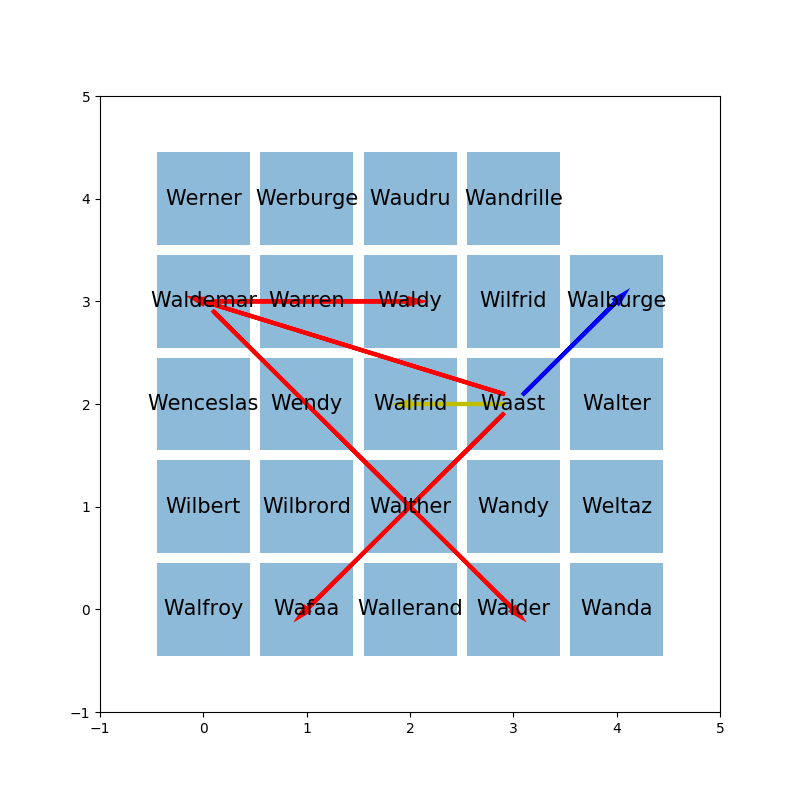
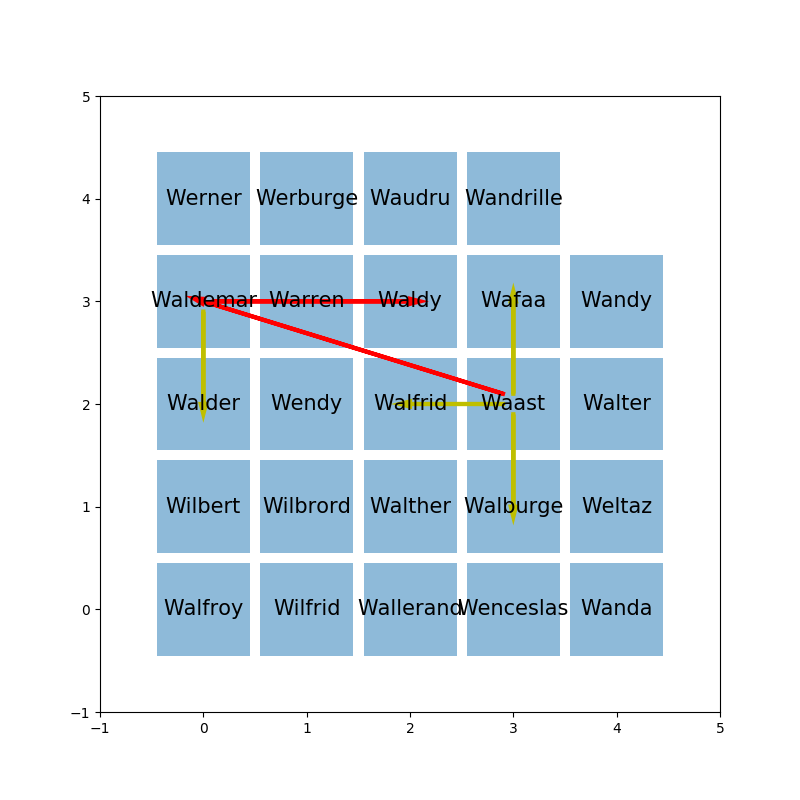

.. index:: voisin amis

.. _l-prog_voisin_amis_sol:

Les chaises chaotiques (solution)
=================================

Le problème n'est pas évident à résoudre et il n'existe pas
d'algorithme rapide qui retourne la solution parfaite.

**Q1 :** Il n'y a pas de solution unique. Dans une salle de classe rectangulaire,
il suffit de retourner la disposition, le premier rang devient le dernier, le
second rang devient l'avant-dernier. C'est la même disposition mais symétrique.
C'est comme regarder la classe dans un miroir. Alors si on trouve une bonne solution,
il en existe une autre tout aussi bonne par symétrie.

**Q2 :** Le problème consiste à faire en sorte que deux amis soient voisins,
deux la distance entre deux amis soit la plus petite possible. Comme on veut que cela le
cas pour toutes les pairs d'amis, on veut que toutes les distances soient les plus
petites possibles. Comme on ne peut pas toujours contenter tout le monde,
on va chercher à obtenir la plus petite somme des distances possibles.

L'idée derrière cet exercice est de partir d'une idée simple puis de la décrire
étape par étape. L'idée consiste à considérer la paire d'amis les plus éloignés
l'un de l'autre et de voir si cela améliore la situation.

#. On choisit la paire d'amis les plus éloignés.
#. On échange les positions.
#. On calcule la somme des distances de chaque paire.
#. Si la nouvelle somme est plus petite que la précédente,
   on garde la nouvelle disposition et on retourne
   à l'étape 1. Dans le cas contraire, on passe à une autre
   paire d'amis et on retourne à l'étape 2.

Il y a plein de façon d'améliorer ce premier jet mais ce n'est
pas tant la solution que la façon de la construire qu'il faut retenir.
Le module :mod:`classroom <code_beatrix.algorithm.classroom>`
contient les fonctions qui ont permis de produire la suite d'images
qui suit.

Illustration de la solution
+++++++++++++++++++++++++++

.. image:: images/classroom_0001.png
    :width: 400px

.. image:: images/classroom_0002.png
    :width: 400px

.. image:: images/classroom_0004.png
    :width: 400px

.. image:: images/classroom_0005.png
    :width: 400px

.. image:: images/classroom_0006.png
    :width: 400px

.. image:: images/classroom_0008.png
    :width: 400px

.. image:: images/classroom_0009.png
    :width: 400px

.. image:: images/classroom_0010.png
    :width: 400px

.. image:: images/classroom_0011.png
    :width: 400px

.. image:: images/classroom_0013.png
    :width: 400px

.. image:: images/classroom_0015.png
    :width: 400px

.. image:: images/classroom_0016.png
    :width: 400px

.. image:: images/classroom_0017.png
    :width: 400px

.. image:: images/classroom_0018.png
    :width: 400px

.. image:: images/classroom_0019.png
    :width: 400px

Pour aller plus loin
++++++++++++++++++++

L'algorithme proposé est assez simple et peut être amélioré.
Les `cartes de Kohonen <https://fr.wikipedia.org/wiki/Carte_auto_adaptative>`_
sont une autre solution également possible. Cette version s'inspire
de la version développée pour les
`plus court chemin passant par tous les noeuds d'un graphe <http://www.xavierdupre.fr/app/ensae_teaching_cs/helpsphinx3/specials/tsp_kohonen.html?highlight=kohonen>`_.
