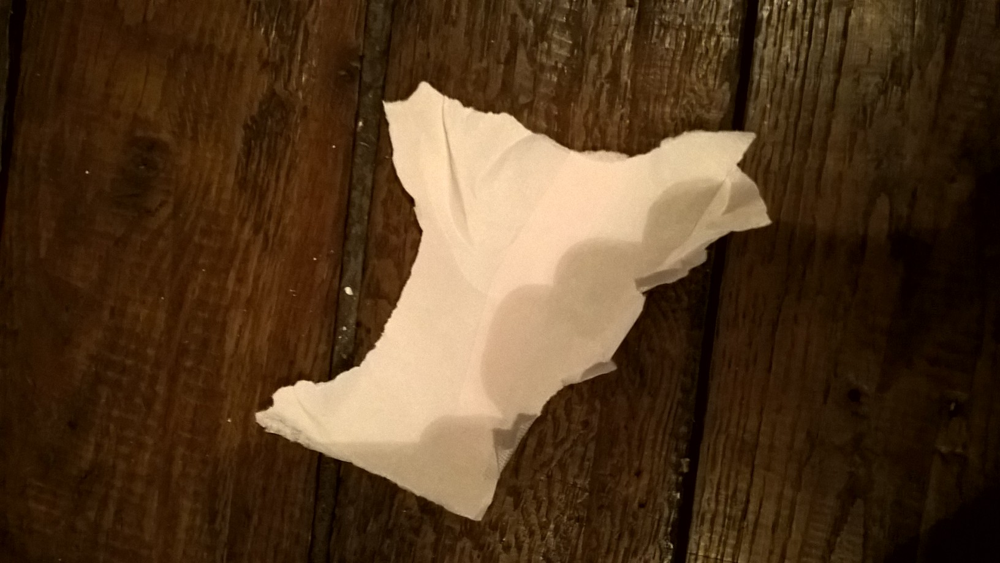

.. index:: angle droit, géométrie, équerre

.. _l-algo_angle_droit:

Angles droits
=============

A partir de 7-8 ans (mais ce n'est qu'une indication).

Que fait quand on n'a pas d'équerre mais seulement un fichu bout de papier ?
Il faut imaginer qu'on est en train de poser des étagères et qu'on
voudrait les poser perpendiculairement au mur.

Mise en scène
-------------

On prend une feuille de papier à laquelle on enlève les quatre coins.
Comment faire pour obtenir un angle droit avec ce bout de papier
qui n'en a aucun ?

**astuce**

Il faudra sans doute plier un peu et l'astuce marche aussi pour les angles à 45 degrés.

Solution
--------

Voir :ref:`l-algo_angle_droit_sol`.
