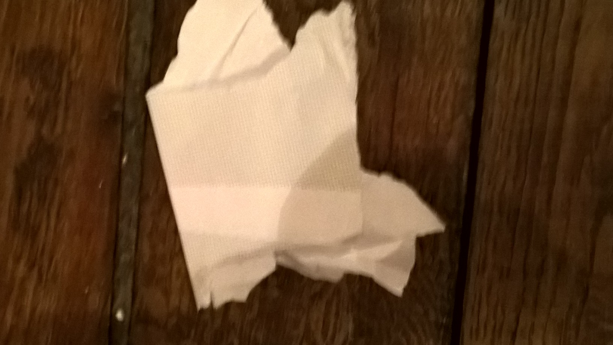
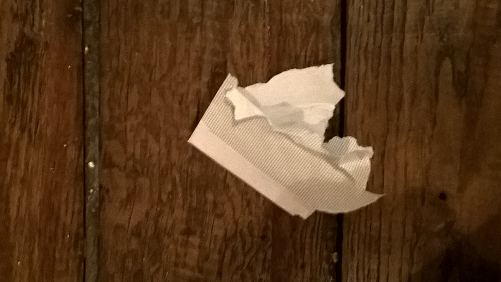

.. index:: solution, angle droit, géométrie, bissectrice

.. _l-algo_angle_droit_sol:

Angles droits (solution)
========================

Il faut d'abord plier la feuille en deux pour obtenir un bord droit.
Ensuite, on plie encore en superposant ce bord droit sur lui-même.
Le second pli fait un angle droit avec le premier.

En suivant, le même procédé, on peut obtenir un angle de 45 degré.
On plie selon la bissectrice de l'angle.

A quoi ça sert ?
----------------

On s'en sert parfois lorsqu'on fait de la peinture et qu'on veut peindre deux
zones de couleurs différentes. Plutôt que d'utiliser du scotch, on
construire ce genre de pochoir inversé.
On lui donne plusieurs épaisseurs pour qu'il soit plus rigide.
