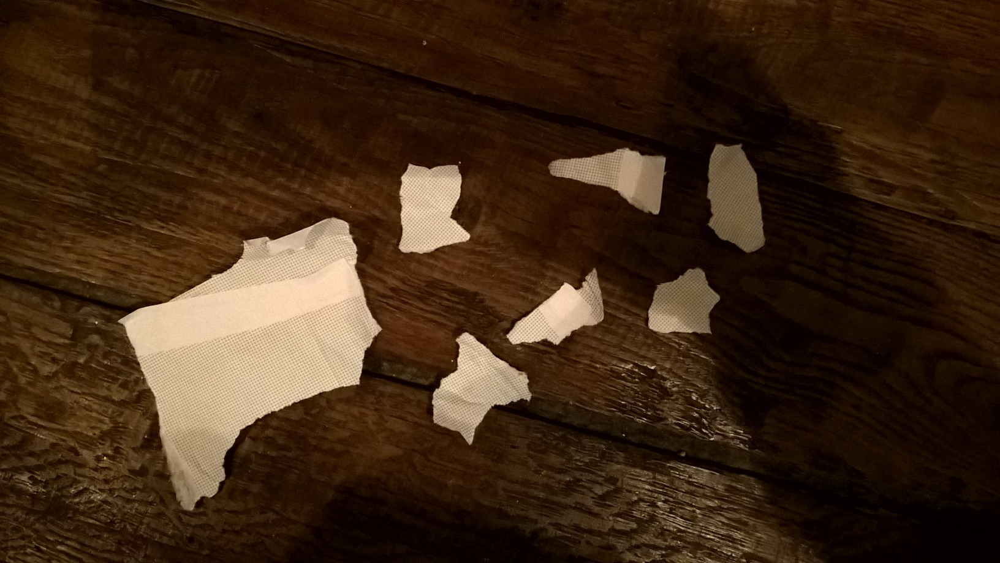

.. index:: confettis, log, algorithme

.. _l-algo_confetti_logn:

Confettis log(n)
================

A partir de 4-5 ans (mais ce n'est qu'une indication).

C'est une histoire qui a commencé en cours d'informatique où les feutres
manquaient pour pouvoir écrire au tableau. Je propose alors d'écrire
sur le tableau avec un tube de colle puis de lancer des confettis afin
recouvrir la trace invisible. Quelques élèves sortent alors
une feuille de papier et commencer à déchirer des petits morceaux.

Mais nous sommes en cours de programmation et d'algorithmique.
Je m'écris : pourriez-vous faire des *confettis log(n)* ?

Il faut prononcer *confettis logue de henne*.

Mise en scène
-------------

Pour jouer à ce jeu, il suffit d'une feuille de papier,
d'une perforatrice. Les formes d'étoiles marchent tout aussi bien.
Comment faire pour perforer à tout va et transformer cette feuille 
de papier en confettis pour qu'il n'en reste plus rien ?

**astuce**

Comment faire plusieurs confettis d'un seul coup sans appeler ses copains
et sans utiliser d'autres perforatrices ?

Solution
--------

Voir :ref:`l-algo_confetti_sol`.

A quoi ça sert ?
----------------

Le papier carbone n'est plus guère utilisé et pourtant il repose sur ce 
même principe.
