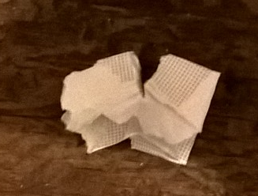
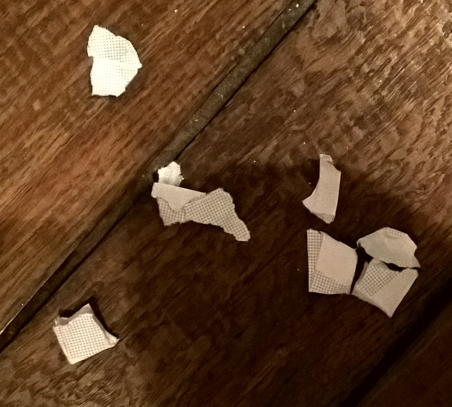

.. index:: solution, algorithme, confettis, pliage, log, logarthime

.. _l-algo_confetti_sol:

Confettis log(n) (solution)
===========================

L'astuce consiste simplement à plier la feuille
plusieurs fois puis de perforer. A chaque perforation,
il sort autant de confetti que le nombre de plis.
Il n'est pas possible de plier indéfiniment, 
la feuille devient vite difficile à percer.
Il y a un compromis à trouver.

Mais alors pourquoi *confettis log(n)* ?

Lorsqu'on plie une fois la feuille, chaque perforation produit
deux confettis. On va deux fois plus vite. Si on plie deux fois la feuille,
il y a quatre épaisseurs. On va quatre fois plus vite. Si on plie trois fois,
il y a huit épaisseurs. On va huit fois plus vite.

Et si on raisonne à l'envers. En dix secondes, une personne
a fait 10 confettis et une autre 80. Il y a 8 fois plus de confettis.
Combien de fois a-t-elle plié sa feuille ? 
La réponse est :math:`3 = \ln_2 8` où :math:`\ln_2(x)`
est le logarithme en base 2 de *x*.

A quoi ça sert ?
----------------

Pour découper deux formes identiques, le plus simple
est de les découper en même temps. Elles sont identiques
aux imperfections près.