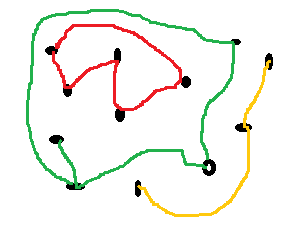

.. index:: connexe, composane connexe, chemin, noeud, graphe, arc

.. _l-algo_connexe:

Faire le tour de ses amis
=========================

A partir de 4-5 ans (mais ce n'est qu'une indication).

Un graphe est une structure à la fois naturelle et mathématiquement pas toujours
évidente à cerner. Il est composé de noeuds et d'arcs qui relient ces noeuds.
Le réseau routier est un graphe : les noeuds sont les villes, les arcs sont les routes.
Facebook est un graphe : les noeuds sont les pofils, les arcs sont les connexions.
Un chemin est une suite d'un ou plusieurs arcs qui relient deux noeuds. On les représente
parfois sous cette forme assez schématique :

.. image:: https://upload.wikimedia.org/wikipedia/commons/thumb/7/74/Chromatically_equivalent_graphs.svg/220px-Chromatically_equivalent_graphs.svg.png

A partir de là, on peut définir ce que sont les
`composantes connexes <https://fr.wikipedia.org/wiki/Graphe_connexe>`_ dans un graphe.
C'est un ensemble de noeuds qui son liées les unes aux autres : si on en prend
deux dans cet ensemble, on peut toujours trouver un chemin qui les relie. Si on prend un noeud
dans l'ensemble et un autre en dehors, il n'existe pas de chemin qui les relie.

**Q1 :** Dans l'image suivante, il y a trois composantes connexes, saurez-vous les trouver ?

Mise en scène
-------------

Il est visuellement facile de trouver les composantes connexes...
quand le graphe est petit, que les arcs ne se croisent pas trop.

On remplit des bouteilles d'eau (une dizaine) qu'on dispose un peu n'importe comment dans une salle
ou on demande à chaque enfant du groupe de se poser dans la pièce.
On relie les bouteilles ou les enfants par une ficelle.

Puis on plonge la pièce dans le noir ou on bande les yeux de celui qui entre dans la pièce.
Il doit retrouver les composantes connexes du graphe sans pouvoir s'aider de ses yeux
et poser au pied de chaque bouteille ou personne une carte de la même couleur.

**Q2 :** à partir de là, comment fait-on ?

Pour gagner le jeu, chaque composante
connexe doit avoir une carte de couleur différente (pique, coeur, trèfle, carreau)
et chaque bouteille ou personne doit avoir à ses pieds une carte de couleur.

**Q3 :** On n'a pas l'impression de tourner en rond ?

A quoi ça sert ?
----------------

.. index:: coloriage

Sans le savoir, trouver les composantes connexes dans un graphe revient à colorier
le graphe. On choisit une bouteille et on la colorie en rouge. On suit toutes les ficelles
qui la relient à d'autres et on colorie les autres de la même couleur.

Solution
--------

Voir :ref:`l-algo_connexe_sol`.
