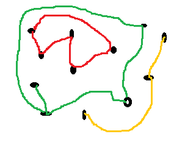

.. _l-algo_connexe_sol:

Faire le tour de ses amis (solution)
====================================

**Q1 :**

Il y a trois composantes connexes, chacune d'une couleur différente.

**Q2 :**

Comme celui qui cherche à trouver les composantes connexes ne voit rien,
il n'a pas d'autre choix que d'errer à la recherche d'un premier noeud ou de
la première personne. Une fois qu'il l'a trouvé, il va suivre les fils
jusqu'au suivant ou la suivante et ainsi de suite.

**Q3 :**

Comme on est dans le noir, il est difficile de savoir si on est
déjà passé au même endroit. C'est important car sinon, on risque de tourner
indéfiniment en rond. La carte laissée par terre indique si on est déjà passé
par là. Si on a l'impression d'avoir fait le tour, on peut recommencer à
errer dans la pièce et passer à la composane connexe suivante.

La solution est illustrée par la correction à ce problème
similaire : :ref:`l-algo_division_sol`.
