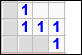
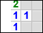

.. issue.

.. _l-algo_demineur:

Le démineur
===========

A partir de 7-8 ans (mais ce n'est qu'une indication).

Règles
------

Le démineur est un jeu que se joue seul. Il faut poser un drapeau sur toutes les mines
d'un champ sans se tromper.

Chaque case contient :

* une bombe
* ou le nombre de bombes dans les huit cases adjacentes (ce nombre est donc compris entre
  0 et 8)

Il faut trouver toutes les bombes à partir des nombres indiquées dans les cases sans bombes.

Mais tout d'abord, une partie :
`démineur <http://demineur.hugames.fr/index.php#level-3>`_.

Où sont les bombes et où elles ne sont pas
------------------------------------------

Sur ces exemples, il faut trouver toutes les bombes et toutes les cases vides possibles.

**Q1 :** 

.. image:: demineur_q1.png

**Q2 :** 

**Q3 :** 

.. image:: demineur_q3.png

**Q4 :** 

**Q5 :** 

.. image:: demineur_q5.png

**Q6 :** 

.. image:: demineur_q6.png

**Q7 :** 

.. image:: demineur_q7.png

**Q8 :** 

.. image:: demineur_q8.png

**Q9 :** 

.. image:: demineur_q9.png

**Q10 :** 

.. image:: demineur_q10.png

**Q11 :**  Peut-on conclure ?

.. image:: demineur_q11.png

**Q12:** S'il restait 4 bombes à placer, pourrait-on placer les bombes du coin supérieur gauche ?

Solution
--------

Voir :ref:`l-algo_demineur_sol`.

