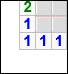
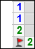
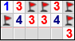
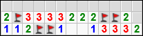
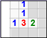

.. issue.

.. _l-algo_demineur:

.. index:: démineur, énoncé, énigme

Le démineur
===========

A partir de 7-8 ans (mais ce n'est qu'une indication).

Règles
------

Le démineur est un jeu que se joue seul. Il faut poser un drapeau sur toutes les mines
d'un champ sans se tromper.

.. image:: demin1.png

Chaque case contient :

* une bombe
* ou le nombre de bombes dans les huit cases adjacentes (ce nombre est donc compris entre
  0 et 8)

Il faut trouver toutes les bombes à partir des nombres indiquées dans les cases sans bombes.

Mais tout d'abord, une partie :
`démineur <http://demineur.hugames.fr/index.php#level-3>`_.

Où sont les bombes et où elles ne sont pas
------------------------------------------

Sur ces exemples, il faut trouver le plus de bombes et le plus de cases vides possibles.

**Q1 :** 

**Q2 :** 

.. image:: demineur_q2.png

**Q3 :** 

**Q4 :** 

.. image:: demineur_q4.png

**Q5 :** 

**Q6 :** 

**Q7 :** 

**Q8 :** 

**Q9 :** 

**Q10 :** 

**Q11 :**  Peut-on conclure ?

.. image:: demineur_q11.png

**Q12:** S'il restait 4 bombes à placer, pourrait-on placer les bombes du coin supérieur gauche ?

Solution
--------

Voir :ref:`l-algo_demineur_sol`.

A quoi ça sert ?
----------------

A résoudre l'énigme que Hermionne résoud dans le premier tome d'Harry Potter et que je reproduis ici 
(source : `L'encyclopédie Harry Potter <http://www.encyclopedie-hp.org/forums/viewtopic.php?t=2430>`_) :

    #. Il y a trois fioles de poison, deux fioles de vin d'ortie, une fiole permettant d'avancer et une
       fiole permettant de reculer.
    #. Immédiatement à gauche de chacune des deux fioles de vin se trouve une fiole de poison.
    #. Les fioles 1 et 7 ont des contenus différents ; ni l'une ni l'autre n'est la fiole qui permet d'avance.
    #. Ni la fiole la plus grande (fiole 6) ni la plus petite (fiole 3) ne contient du poison.
    #. Les contenus des fioles 2 et 6 sont identiques.

Lorsqu'on cherche à résoudre une énigme, chaque indice élimine des possibilités.
Lorsqu'il n'en reste plus qu'une, on a trouvé. La vitesse à laquelle on trouve dépend
des indices qu'on considère en premier. On cherche toujours à éliminer un grand nombre de possibilités
le plus tôt possible.
Pour finir, je citerai *Arthur Conan Doyle* (l'auteur des Sherlock Holmes) :

    Lorsque vous avez éliminé l'impossible, ce qui reste, si improbable soit-il, est nécessairement la vérité.
    
    

