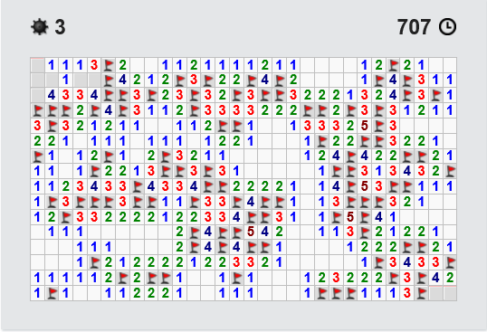

.. index:: démineur, solution, énigme

.. _l-algo_demineur_sol:

Le démineur (solution)
======================

Pour trouver les solutions, il faut essayer !
Quand on hésite entre deux cases, on pose un drapeau et on regarde
si on aboutit pas à une contradiction.

**Q11 :**

Non, on ne peut pas conclure. Les deux situations sont isolées
(trouver l'un n'aidera pas l'autre).

**Q12 :**

La réponse est oui. S'il restait 4 bombes à placer, il en faudrait toujours une
en bas. En haut, il n'y a qu'un seul moyen de placer 3 bombes
avec les nombres donnés par l'image.

