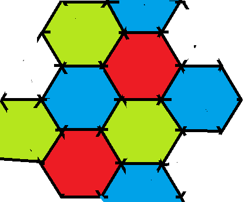
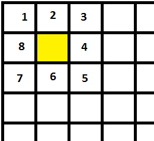

.. _l-algo_dessin_barriere_sol:

Barrière d'arbres (solution)
============================

L'agriculteur doit planter des arbres dans un arbre de telle sorte que
chaque arbre est un voisin différent. Si on associe une couleur à chaque 
arbre différent. Une des réponses qui vient à l'esprit :

On a besoin de quatre couleurs, soit deux lignes de deux couleurs différentes
qui s'enchevêtrent. Peut-on faire la même chose avec trois couleurs (ou trois arbres) ?
On s'aperçoit tout d'abord qu'avant de colorier, il faut imaginer une grille.

La grille est une façon de disposer les arbres dans un champ, que ce champ soit
petit ou grand. C'est comme si on posait des dalles de carrelage dans une pièce, 
comme si on plantait un arbre sur chaque dalle. Imaginez-vous dans une salle de bain
en train de peindre chaque carreau d'une couleur différente de sorte que
chaque dalle n'ait pas de voisine de la même couleur.
Pour réduire le nombre de couleur, il faut changer de grille.
Au marché, les piles de fruits ne sont pas carrées, elles ressemblent plutôt à
ceci :

On dessine ensuite des triangles (en bleu) et on entoure les cercles 
de rouge pour former des hexagones (en rouge) :

On enlève les cercles et les triangles pour ne garder que les hexagones :

Et on colorie :

Avec des cercles, cela donne ceci :

.. image:: images/biodiversite_tri.png

Nous n'avons utilisé que trois couleurs.
Peut-on faire uniquement avec deux couleurs ?
Pour répondre à cette question, il faut s'en poser une autre.
Moins un arbre a de voisins, moins on a besoin de couleur.
Dans le cas d'un quadrillage carré, un arbre a huit voisins :

Ou plutôt comme ceci :

Avec un quadrillage hexagonal, un arbre a six voisins :

Un arbre peut-il avoir moins de six voisins ?
On voit que les six cercles voisins
touchent le cercle central. Lorsqu'il y a huit voisins, 
ils ne touchent pas tous le rond central.
Il est donc impossible d'avoir moins de six voisins sauf si le rond central est
plus petit :

.. image:: images/rondpe.png

Et dans cette configuration là, le plus petit nombre de voisins
est trois. On ne peut pas faire moins de trois voisins.
Et pour colorier trois cercles qui se touchent, il faut
au moins trois couleurs.

On a donc démontré (ou prouvé) qu'il faut au moins trois
couleurs et donc trois arbres différents afin que dans un champ,
aucun arbre n'ait un voisin qui lui ressemble.

