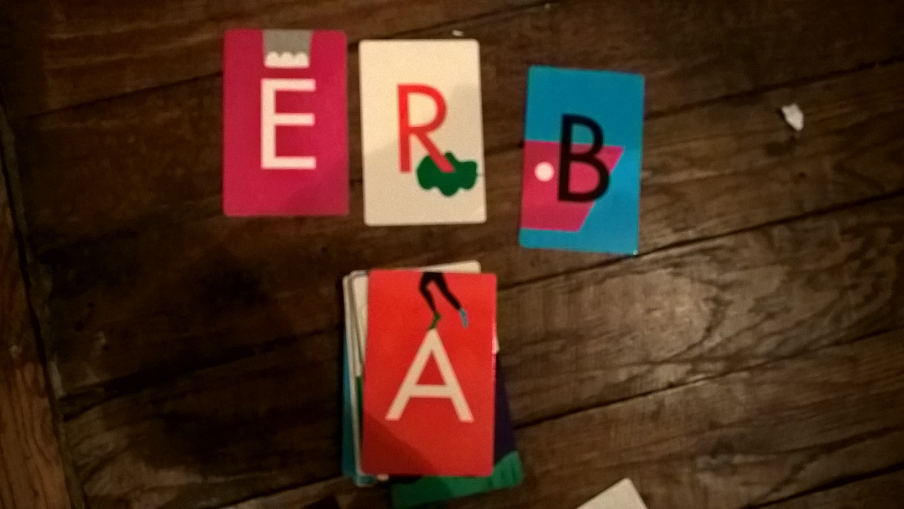

.. _l-algo_dichotomie:

Dichotomie et tri
=================

A partir de 5-6 ans (mais ce n'est qu'une indication).

Trier des nombres dans le sens croissant, c'est facile. Et pourtant,
lorsqu'on a les yeux bandés, cela se complique un peu plus.

Mise en scène
-------------

Le jeu se joue à deux. On dispose qu'un paquet de carte représentant des lettres ou des chiffres.
Le jeu de cartes est mélangé.
L'un des deux joueurs a les yeux bandés et pourtant il doit trier le paquet de cartes
en suivant les instructions de l'autres. On peut soit considérer de ranger les cartes par
ordre croissant ou par couleurs s'il y a suffisamment de couleurs (6, 7). Et bien évidemment,
il faut aller le plus vite possible.

**astuce**

Il n'est pas évident pour un aveugle de faire plusieurs piles rangées
sur la table. Et si on en réduisait le nombre...

Question subsidiaire : combien de fois a-t-on déplacé une carte pour arriver au résultat final ?

Solution
--------

Voir :ref:`l-algo_dichotomie_sol`.

A quoi ça sert ?
----------------

Avez-vous jamais demandé par téléphone à votre frère de regarder sur votre bureau pour savoir si 
vous n'aviez pas oublié quelque chose ? Et sa logique à lui est tout-à-fait différente de la 
vôtre. Il cherchera à un endroit alors que vous en auriez choisi un autre. Il lui faut des
instructions précises. Et si jamais ce que vous lui demander de trouver est un document
insérée dans une pile de papiers triés selon un ordre qui vous est propre ? Ce sont des 
situations dans lesquelles on se retrouve parfois et pour lesquelles on utilises des astuces
pas si éloignées que ça de celles qu'on utilisera dans ce tri à l'aveugle.

