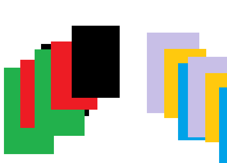
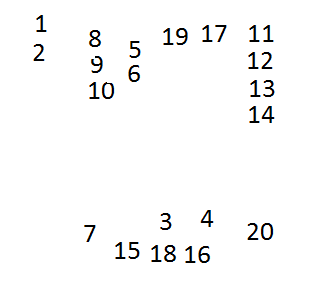
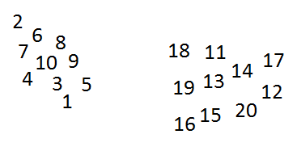

.. _l-algo_dichotomie_sol:

Dichotomie et tri (solution)
============================

Dans le cas où il faut trier des couleurs, la solution naïve consiste
à faire un tas pour chaque couleur. C'est très facile à concevoir mais
un peu plus difficile à appliquer pour celui qui ne peut pas voir.

Lorsque l'aveugle tire une nouvelle carte, il faut lui indiquer sur quelle paquet la poser.
Plus il y en a, plus c'est difficile. On se trompe et on perd beaucoup de temps. L'idée consiste 
alors à faire une première étape où on décide qu'on va mettre trois couleurs d'un côté,
trois couleurs de l'autre.

Lors de cette première étape, celui qui dicte les opérations n'a qu'à dire
droite ou gauche selon les couleurs. On obtient deux paquets mélangés mais pour lesquels
on sait qu'il n'y a plus que trois couleurs dans chaque. Il suffit de trier chaque des deux.

Dans le cas des lettres ou des numéros, la solution consiste à procéder un peu comme dans le jeu 
du `solitaire <https://fr.wikipedia.org/wiki/Solitaire_(patience)>`_. On fait des piles de 
cartes consécutives. Lorsqu'une nouvelle carte apparaît, soit on peut la rattacher à une pile
existante, soit on cré une nouvelle pile. En bas, ce qui reste à trier, en haut, les piles.

Mais on se retrouve encore dans le cas où la personne qui trie, l'aveugle, a beaucoup de mal
à se retrouver dans la pile de droite, celle de droite à droite encore, celle de gauche à droite et
un peu plus à gauche...
Pour aller plus vite, on aussi utiliser la même astuce que celle utilisée pour les couleurs. 
On met d'un côté tous les nombres supérieurs à la moitié (10 dans ce cas) et tous les autres de l'autre côté.

On recommence pour chacun des deux paquets jusqu'à ce qu'on n'en ait plus que quelques unes
qu'on peut trier facilement.

**Combien de fois a-t-on déplacer une carte ?**

Le calcul n'est pas très compliqué mais il ne faut rien oublier en route :

* Pour couper un paquet de 26 lettres en deux, il faut passer tous les cartes en revue, 
  on déplace 26 cartes.
* On prend ensuite chaque paquet de 13 cartes qu'on coupe encore en 2.
  Pour chaque paquet, on passe en revue 13 cartes, soit 13 x 2 = 26.
* On a maintenant 4 paquets et on va devoir passer en revue toutes les cartes de chaque paquet,
  soit 26 encore.
  
Au final, on aura déplacé 26 + 26 + 26 + ... Quand est-ce qu'on s'arrête ? 
Tout simplement quand les paquets sont trops petits pour être découpés.
Soit :

* 26 / 2 = 13
* 26 / 4 = 6
* 26 / 8 = 3
* 26 / 16 = 1

.. index:: tri fusion, fusion

Il ne sert à rien d'aller plus bas. On aura déplacé 26 * 4 = 104 cartes en tout
pour trier le paquet. Ce tri s'appelle un 
`tri fusion <https://fr.wikipedia.org/wiki/Tri_fusion>`_.
  

A quoi ça sert ?
----------------

La dichotomie est employée pour aller plus vite. Un fois que le paquet est découpé en 2.
On peut demander à deux personnes de trier chaque petit paquet. On va beaucoup plus vite 
à plusieurs. On découpe en 2 parce que c'est plus simple que de découper en 3 et qu'on
ne va pas plus vite en découpant en 3 plutôt qu'en 2. On utilise ce procédé sans le savoir
dès qu'on travaille à plusieurs : comment se répartir le travail de façon intelligente 
pour aller plus vite à plusieurs que lentement tout seul. Si on arrive à répondre à cette question,
le tour est joué.
