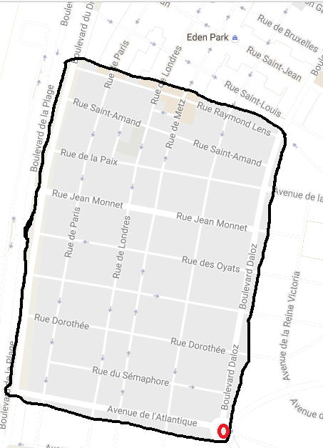

.. index:: facteur chinois

.. _l-algo_facteur_chinois:

La tournée du camion poubelle
=============================

A partir de 7-8 ans (mais ce n'est qu'une indication).

Un camion poubelle doit passer dans toutes les rues d'une ville pour
récolter tous les déchets. Il va avoir un petit peu d'aide car il ne sait
pas comment faire pour trouver le chemin le plus court passant
par toutes les rues.

Mise en scène
-------------

On part de la carte de votre ville. Avec un feutre, on encercle la zone
dans laquelle le camion poubelle devra traverser toutes les rues. On recouvre la carte
de papier calque. Avec un feutre d'une autre couleur, on surligne les rues
par lesquelles le camion poubelle passe et on numérote le rues dans l'ordre
dans lequel on les parcourt. Quelques dessins de difficulté croissantes :

Un peu plus dur :

Toujours un peu plus dur :

.. image:: images/touquet.png

Quelques indices :

**Q1 :** Le point de départ importe-t-il peu ?

**Q2 :** Avez-vous lu cette histoire sur les
`sept ponts de Königsberg <https://fr.wikipedia.org/wiki/Probl%C3%A8me_des_sept_ponts_de_K%C3%B6nigsberg>`_ ?
Il est possible qu'elle ait un lien avec l'histoire du camion poubelle.

**Q3 :** Maintenant que vous avez bien planché sur ces grands dessins,
que diriez-vous de ces deux petits dessins ? Existe-t-il un moyen
de parcourir ces deux petits réseaux de rues en ne passant qu'une seule
fois par chaque rue ? Car si cela était possible, nous serions sûr alors
d'avoir trouvé le chemin le plus court...

Un problème simple avec la `ville de Seattle <http://www.xavierdupre.fr/app/ensae_projects/helpsphinx/notebooks/city_tour_1.html#problem-definition>`_.
Les villes en quadrillage sont un peu plus faciles.

Solution
--------

Voir :ref:`l-algo_facteur_chinois_sol`.

A quoi ça sert ?
----------------

Le camion poubelle est un exemple d'utilisation.
La tournée d'un homme politique pour visiter ses concitoyens en est un autre.
