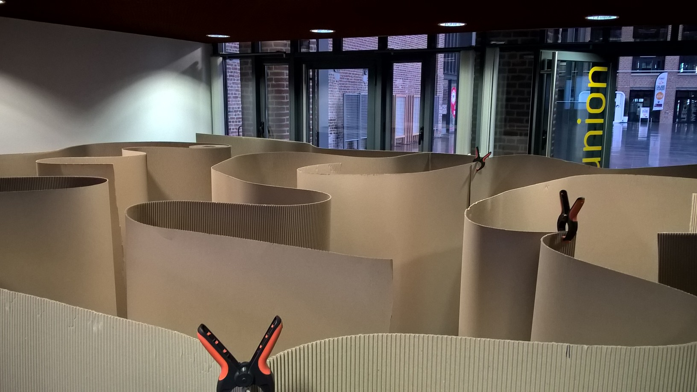

.. index:: énoncé, algorithme, labyrinthe, Lille, 2018

.. _l-algo_labyrinthe:

Retrouver son chemin avec moins de cailloux que le Petit Poucet
===============================================================

A partir de 5-6 ans (mais ce n'est qu'une indication).

Mise en scène
-------------

.. image:: labyrinthe.png

Ou quelque chose comme ceci :

    

Le jeu se joue à deux équipes sachant qu'une équipe doit parcourir
le labyrinthe en rapportant le trésor.

#. La première équipe cache un trésor dans le labyrinthe.
   Il faut qu'il ne soit pas trop facile à trouver.
#. La seconde équipe, sauf un joueur, entre dans le labyrinthe, 
   trouve le trésor (mais le laisse) puis la sortie.
#. La seconde équipe établit une stratégie : il faut utiliser six gobelets
   du mieux qu'elle peut pour indiquer le chemin au dernier joueur
   qui doit entrer dans le labyrinthe pour ramener le trésor
   et sans se tromper.
#. Le dernier joueur parcourt le labyrinthe en suivant les instructions.

On échange les rôles et on vote pour connaître la meilleure des deux stratégies.

Solution
--------

Voir :ref:`l-algo_labyrinthe`.

A quoi ça sert ?
----------------
