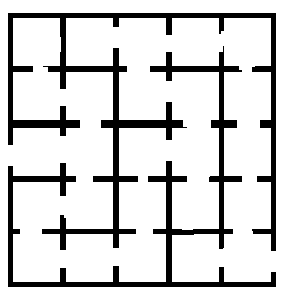
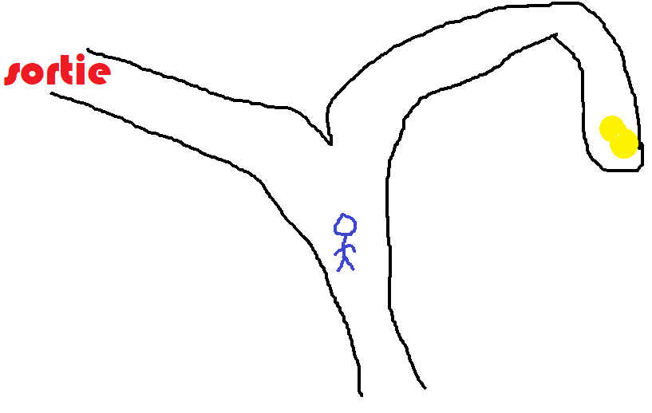
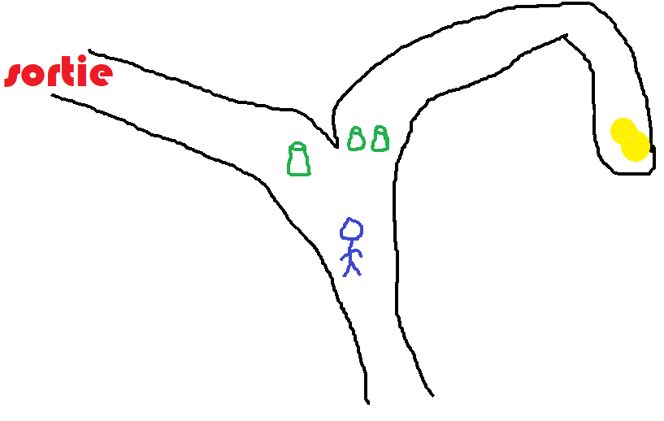
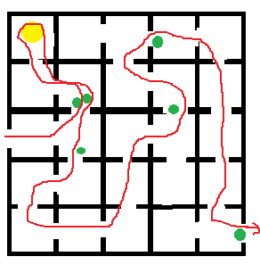

.. _l-algo_labyrinthe_sol:

Retrouver son chemin (solution)
===============================

Comme toutes les équipes avaient une vue d'ensemble du
labyrinthe, la stratégie est devenue simplement :
*"suivez les gobelets"*. La dernière personne de l'équipe
devait suivre le chemin dans le labyrinthe marqué par les
gobelets pour ramasser le trésor et trouver la sortie.
Tous ont trouvé que les aiguillages posaient problème
et qu'il suffisait de placer un gobelet devant la branche
à suivre pour résoudre le problème.

Mais voilà, arrivé à l'aiguillage, une personne ne sachant
pas ce qui se cache dans chacune des branches ne saura pas quelle
direction choisir si on dépose un gobelet devant chaque chemin
à moins de différencier l'une des deux branches avec un code
comme celui de poser deux gobelets devant la branche trésor.

La prochaine fois, il faudra que je trace un labyrinthe un peu
plus grand que celui-ci avec les gobelets placés aux bons endroits.

Il faudra faire plus grand la prochaine fois.
