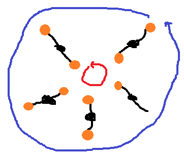


.. issue.

.. index:: énoncé, algorithme, orange, tri

.. _l-algo_orange:

Le jeu des oranges
==================

A partir de 7-8 ans (mais ce n'est qu'une indication).

C'est un petit jeu où il faut être inventif
pour construire la méthode qui aboutit à la solution.
Il est préférable d'avoir compris ce qu'est un :ref:`tri <l-algo_tri>` au préalable.

Mise en scène
-------------

Cinq enfants sont placés autour d'un cercle. 
Chacun a un numéro.
Il y a neuf orange numérotées, deux numéros 1, deux 2, deux 3, deux 4, un numéro 5.
Au début chaque enfant prend deux oranges au hasard dans chaque main sauf le dernier.

Règle : 

    A chaque tour, seul l'enfant qui a une main vide peut recevoir une orange 
    d'un de ses deux voisins.
    
    Seul l'enfant qui a une main vide peut changer son orange de main.
    
Objectif :

    A la fin du jeu, chaque enfant doit avoir dans ses mains 
    les oranges portant son numéro.
    
    
Indices
-------

Il faut que chaque enfant se tienne de profil et représenter le problème 
comme deux cercles d'oranges dont l'un est incomplet.

Comment faire tourner un cercle ?

Comment faire tourner l'autre cercle ?

La première étape serait de faire tourner un cercle pour avoir 
le plus de numéros qui correspondent.

Solution
--------

Voir :ref:`l-algo_orange_sol`.

A quoi ça sert ?
----------------

Connaissez-vous le `Rubik's cube <http://fr.wikipedia.org/wiki/Rubik%27s_Cube>`_ ?
Si les deux jeux ne sont pas vraiment reliés, cela permet de comprendre
que pour réussir, il faut parfois en apparence défaire ce qui a été fait.
