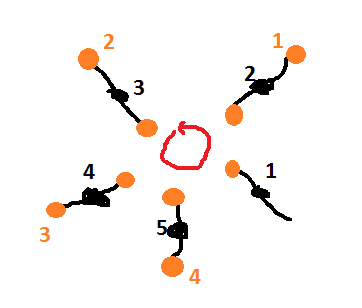

.. index:: algorithme, orange, tri, solution

.. _l-algo_orange_sol:

Le jeu des oranges (solution)
=============================

**Q1 :** 

Il faut déjà que la main vide soit sur ce cercle. Ensuite, il suffit que les oranges
passent de main en main sur ce même cercle.

**Q2 :** 

Pour change de cercle, il faut déplacer la main vide sur ce cercle.
Seul celui qui n'a qu'une orange peut le faire. Il change simplement 
son orange de main.

**Q3 :** 

Lorsque le jeu est fini, chaque participant doit avoir les deux oranges portant son numéro
dans chaque main, une sur dans le cercle intérieur, une dans le cercle extérieur.

Par conséquent, pour se rapprocher de la solution, il faut faire passer un numéro en double
d'un cercle à l'autre. Pour ça :

    On fait tourner le cercle qui ne contient pas ce numéro en double jusqu'à ce que 
    la main vide soit en face de ce numéro et on le fait changer de cercle.
   
Petite astuce, si un cercle contient un numéro en double, l'autre cercle en contient souvent un en double,
mais pas le même. Ensuite, dans l'image qui suit, pensez-vous que les oranges
du cercle extérieur (numéros oranges) soient loin de leur positions finales (numéros noirs) ?

Pas vraiment, d'ailleurs pour y arriver, il suffit de faire tourner le cercle extérieur. Par conséquent,
si sur un cercle, les oranges sont triées dans le bon ordre (ici le sens inverse
des aiguilles d'une montrre), on est pas loin de la solution.

L'algorithme décrit de manière succinte peut s'écrire :

    Il faut faire tourner les deux cercles, échanger des oranges entre les deux
    de telle sorte que les deux cercles contiennent tous deux des numéros distincts
    (pas deux fois le même numéros sur le même cercle) et que les numéros des oranges
    soient triés dans le même ordre que les numéros des enfants.

Et voilà, il ne reste plus qu'à le faire maintenant. Mais :ref:`trier <l-algo_tri>`, on sait faire non ?
