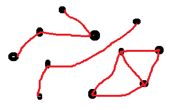

.. index:: parti

.. _l-algo_division:

Le parti divisé
===============

A partir de 7-8 ans (mais ce n'est qu'une indication).

Dans un certain pays, il existe un parti politique pétri d'inimitiés tenaces.
Est-il possible de scinder le parti en deux pour que chaque paire d'ennemis
intangibles se retrouve de part et d'autre du fossé ? [#fdiv1]

Mise en scène
-------------

On remplit des bouteilles d'eau (une dizaine) qu'on dispose un peu n'importe comment dans une salle.
On relie certaines d'entre elles par une ficelle rouge. Chaque ficelle rouge symbolise deux personnes
qui ne s'apprécient pas. Il faut dire à chaque nouvelle ficelle si on peut
divisier les bouteilles en deux groupes de telles sortes que deux bouteilles
reliées par une ficelle soient chacun dans un groupe différent. Pour ce faire,
on peut utiliser une ficelle de couleur verte pour symboliser par frontière
entre les deux groupes.

L'objectif est de trouver à quelle condition sur les ficelles rouges
on peut couper le groupe de bouteilles en deux.

Quelques indices :

**Q1 :** On considère le groupe de bouteilles suivant avec quelques ficelles rouges.
         On voit clairement deux groupes de bouteilles ! A-t-on besoin de savoir
         comment un groupe est divisé pour diviser l'autre ?

**Q2 :** Que se passe-t-il lorsque trois bouteilles sont reliés entre elles ?

A vous.

**Q3 :** Et quand il y a plus de trois bouteilles ?

Autres options à programmer
---------------------------

.. index:: composante connexe, graphe

Les aspects algorithmiques abordés ici sont très proches du concept
de `composante connexe <https://fr.wikipedia.org/wiki/Graphe_connexe>`_ dans un graphe
(voir :ref:`l-algo_connexe`).
Le *graphe* est ici composé de l'ensemble des bouteilles et des arcs. Le graphe le plus connu
est Facebook où les bouteilles sont les personnes et les ficelles sont des connexions.

Une composante connexe est un groupe de bouteilles qui sont reliées par des ficelles :
on peut passer d'une bouteille (ou noeud du graphe)
à n'importe quelle autre du groupe en suivant les ficelles (ou arc du graphe).

**Q4 :** combien y a-t-il de composantes connexes dans cet ensemble de bouteilles ?

Solution
--------

Voir :ref:`l-algo_division_sol`.

.. index:: coloriage d'une carte, théorème des quatre couleurs, théorème des cinq couleurs

A quoi ça sert ?
----------------

Dans ce problème, on se retrouve dans une situation ou on ne peut pas
colorier de la même couleur deux noeuds du graphe ou deux personnes reliées par un fil.
On ne peut pas colorier deux voisins de la même couleur. Cette situation
est plus fréquente qu'on ne le croit pas et particulièrement
lorsqu'il faut colorier une carte.

*source : `wikipedia <https://fr.wikipedia.org/wiki/Liste_des_d%C3%A9partements_fran%C3%A7ais>`_

Il faut colorier deux départements voisins de couleurs différentes.
Mais combien faut-il de couleurs au maximum ?
Le `Théorème des quatre couleurs <https://fr.wikipedia.org/wiki/Th%C3%A9or%C3%A8me_des_quatre_couleurs>`_
démontre que quatre suffisent sous certaines hypothèses. La démonstration passe par une longue
étude de cas.
Le `théorème des cinq couleurs <https://en.wikipedia.org/wiki/Five_color_theorem>`_ est plus simple
à montrer.

.. [#fdiv1] Ce problème est tiré d'une compétition google code jam :
            `Bad Horse <https://code.google.com/codejam/contest/6234486/dashboard#s=p0>`_
