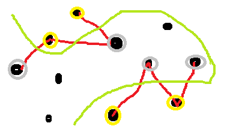
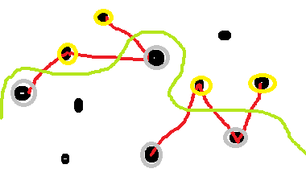
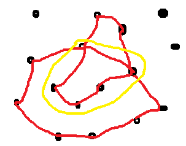
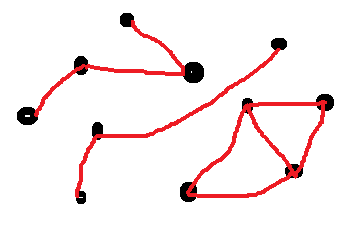
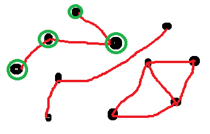
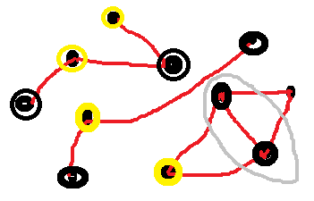



.. index:: parti

.. _l-algo_division_sol:

Le parti divisé (solution)
==========================

**Q1 :** 

La réponse est non. Les deux groupes ne sont reliés par aucune ficelle.
On pourrait avoir cette configuration :

Ou celle-ci :

Dans les deux cas, la ficelle verte *casse* toutes les ficelles rouges.

**Q2 :** 

C'est un cas insoluble, trois bouteilles et toutes reliées, il faudrait ranger les bouteilles
dans trois groupes pour casser toutes les inimitiés. Dans deux groupes, il restera toujours une ficelle.

**Q3 :**

Un groupe de bouteilles reliées par des ficelles :

Parmi elles, on distingue un circuit de cinq bouteilles. Les groupes de cinq bouteilles
sont comme les groupes de trois bouteilles : il est impossible de les séparer en deux groupes.
En fait, dès qu'un peut trouver un circuit avec un nombre impair de bouteilles.

**Q4 :** 

Il y en a trois.

Lorsqu'on tire sur une bouteille, toutes celles qui y sont reliées la suivent.
Il faudra tirer sur au moins trois bouteilles pour débarasser la place
de toutes ses bouteilles.

**Q5 :**

Lorsqu'on a colorié toutes les bouteilles en vert. On choisit une autre couleur,
bleu, puis on continue à suivre les fils et on colorie en bleu toute bouteille
reliée par un fil. Lorsqu'on a fini, il reste encore des bouteilles non coloriées,
on choisit une dernière couleur, orange et on recommence.

Dans le cas du problème des inimitiés, il faut procéder de la même manière 
en changeant une petite chose : à chaque fois qu'on passe d'une bouteille à une autre
en suivant la corde qui les unit, on change de couleur.

Les deux premiers groupes sont scindables. Le dernier ne l'est pas car
deux noeuds voisins sont de la même couleur.

