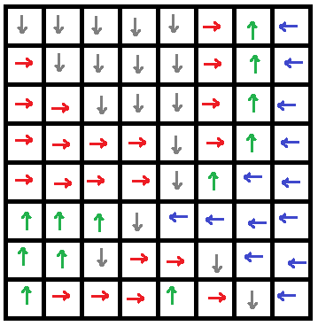

.. _l-algo_coloriage:

Pluie et coloriage
==================

A partir de 6-7 ans (mais ce n'est qu'une indication).

Mise en scène
-------------

On dispose des petits objets tels que des briques de lego dans une baignoire.
On les recouvre d'un bout de toile cirée faite de petits carreaux qu'on saupoudre de farine. 
On arrose ensuite d'eau. Comment deviner où la farine va s'accumuler ?

Pour comprendre le chemin de l'eau, on dessine une flèche qui pointe 
vers le point le plus bas de chaque case de la toile. Cela indique
l'endroit vers lequel l'eau va s'écouler.

#. En utilisant cette grille, quel chemin suit une goutte d'eau 
   qui tombe sur une case ?
#. Quand il pleut sur la grille, chaque case reçoit une goutte d'eau.
   Les gouttes continuent leur route en suivant les flèches.
   Quelle case verra passer le plus de gouttes d'eau ?

Solution
--------

Voir :ref:`l-algo_coloriage_sol`.

A quoi ça sert ?
----------------

En France, il est interdit de construire sur un terrain inondable.
Mais comment sait-on cela au fait ? Si les inondations passées
nous apporte une réponse, l'idée suggérée ici fait partie 
des algorithmes développés pour obtenir ce resultat lorsque le paysage
est modifié. Il faut également tenir compte de la pente et pas 
seulement de sa direction. La nature du terrain a un impact sur 
la vitesse d'écoulement. Les simulations sont effectuées en faisant 
varier la quantité de pluie.
