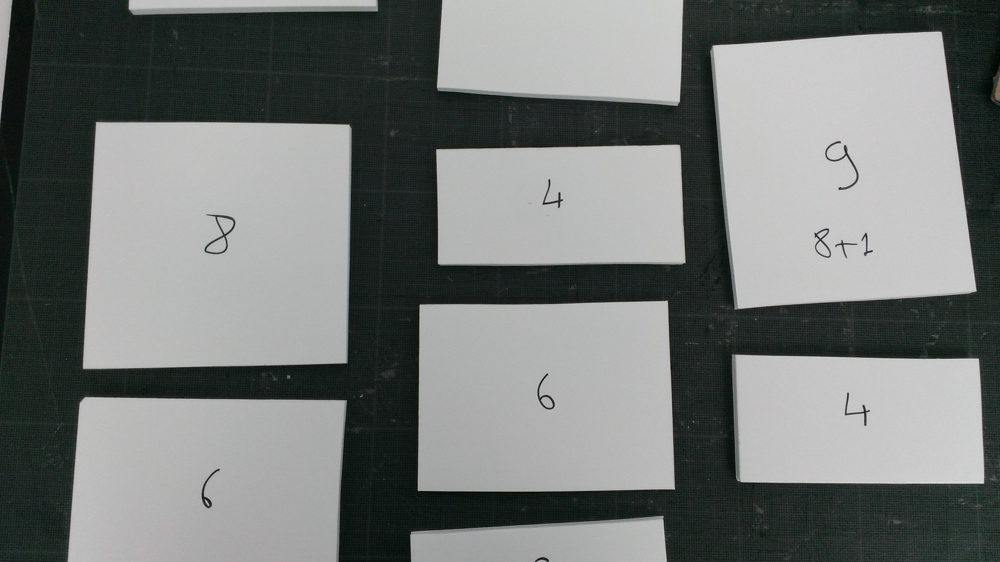

.. index:: sac-à-dos, énoncé, poids, algorithme, Dunkerque 2015-03-25

.. _l-algo_sacados:

Sac-à-dos
=========

A partir de 7-8 ans (mais ce n'est qu'une indication).

Le problème du `sac-à-dos <http://fr.wikipedia.org/wiki/Probl%C3%A8me_du_sac_%C3%A0_dos>`_ 
est un problème très connu. On a un sac qui peut porter 50 kilos et des objets
qui font moins de 50 kilos. Comment remplir le sac-à-dos pour que son
poids soit le plus proche possible des 50 kilos sans jamais dépasser.

Mise en scène
-------------

On construit des briques rectangulaires de même largeur et de hauteur différentes.

    
On les empile sur un plan incliné jusqu'à trouver une combinaison
qui se rapproche du haut sans jamais le dépasser.
    
+-------------------------------+-----------------------------------+
| .. image:: sacados_pile.jpg   | .. image:: sacados_pile2.jpg      |
|     :width: 250 px            |     :width: 250 px                |
+-------------------------------+-----------------------------------+
| début de la pile              | pile trop grande                  |
+-------------------------------+-----------------------------------+

**Q1 :** Quelle est la première brique que vous placeriez sur le plan incliné ?

**Q2 :** Et le suivant ?

**Q3 :** Pourriez-vous décrire précisément ce que vous faites de telle sorte que votre voisin
obtiennent exactement la même solution en reproduisant vos instructions ?

Solution
--------

Voir :ref:`l-algo_sacados_sol`.

A quoi ça sert ?
----------------

Comment rentrez-vous les valises quand vous partez en vacances ou quand vous
déménagez ? Par quelle valise commencez-vous ?

