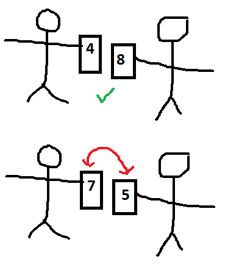
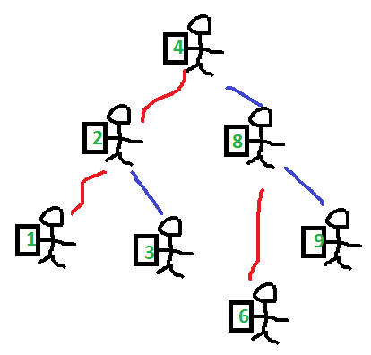

.. issue.

.. index:: énoncé, algorithme, tri

.. _l-algo_tri:

Tri
===

A partir de 7-8 ans (mais ce n'est qu'une indication).

Trier, ordonner, ranger, autant de mots pour désigner le fait de s'arranger 
pour retrouver facilement les choses qu'on a trié. Comment retrouver un livre s'ils 
ne sont pas triés, comment retrouver ses clés si la maison est sens dessus dessous ?

Mise en scène
-------------

**retrouver des cartes**

On mélange un jeu de cartes puis on enlève trois cartes sans les montrer.
On tend le jeu de cartes à 4 personnes qui doivent déterminer les cartes qui manquent.
Les cartes sont parfois trompeuses, elles peuvent ressembler à ça :

ou ça :

**trier**

Même exercice mais on trie d'abord le jeu de cartes. On enlève ensuite trois cartes.
Il faut de nouveau deviner les cartes qui manquent.

**Comment trier ?**

On distribue aux enfants une ou deux cartes (selon le nombre d'enfants ou et de cartes).
On suppose qu'on sait dire si deux cartes sont dans le bon ordre ou pas si on 
les présente de gauche à droite.
Les enfants sont placés en ligne et ne peuvent échanger qu'avec leurs deux voisins. 
Chaque enfant a une position dans la ligne.
La règle est simple : pour deux enfants voisins, 
l'enfant plus proches du début - donc le plus à gauche - doit échanger ses
cartes avec ses voisins si elles ne sont pas dans le bon ordre.

Ce tri correspond au `tri à bulles <http://fr.wikipedia.org/wiki/Tri_%C3%A0_bulles>`_.

**Autre façon de trier**

On remet à tous les enfants sauf un  une carte et deux fils de laine : un rouge, un bleu.

* Le premier enfant choisi aléatoirement se place au milieu de la pièce.
* Le second enfant compare sa carte avec le premier. Si sa carte est
  plus petite, il s'accroche au fil rouge. Si elle est plus grande, il
  s'accroche au fil bleu.
* Le troisième enfant compare sa carte au premier. Si elle est plus petite,
  il s'accroche au fil rouge, si le fil rouge est déjà pris, il compare sa carte
  à celle de l'enfant au bout du fil. Il s'accroche dès qu'il trouve une place libre.

Il existe une façon pour le dernier enfant de ramasser simplement
toutes les cartes dans le bon ordre. Saurez-vous la trouver ?

Il s'agit dans ce dernier cas du `tri par arbre <http://rmdiscala.developpez.com/cours/LesChapitres.html/Cours4/TArbrechap4.6.htm>`_.

Solution
--------

Voir :ref:`l-algo_tri_sol`.

A quoi ça sert ?
----------------

