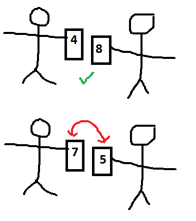
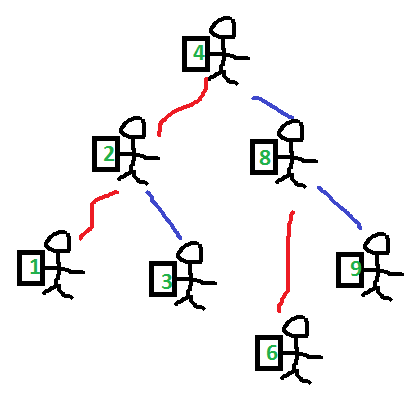
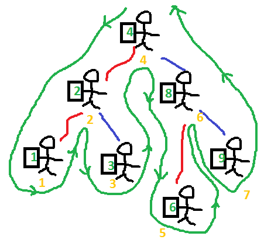
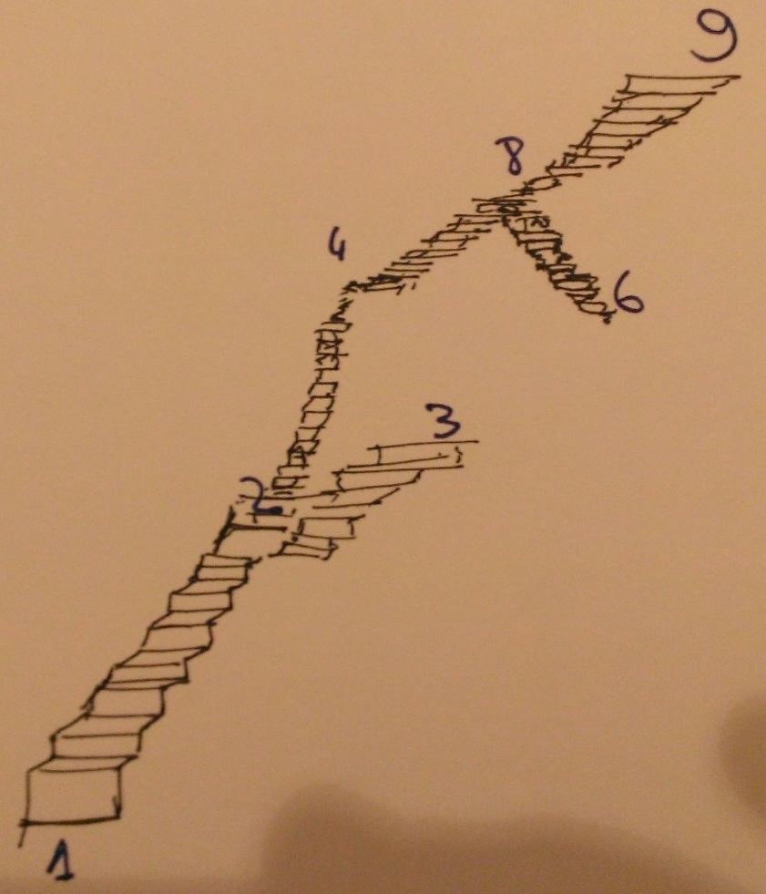
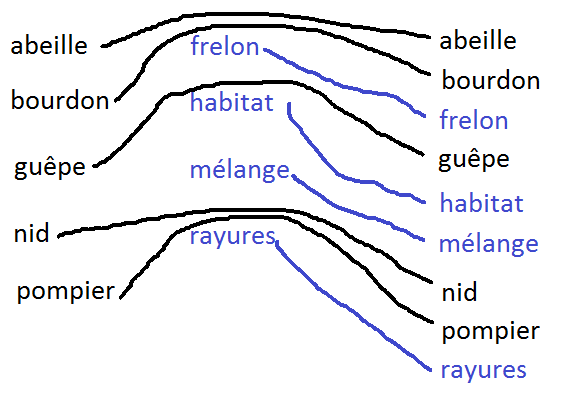
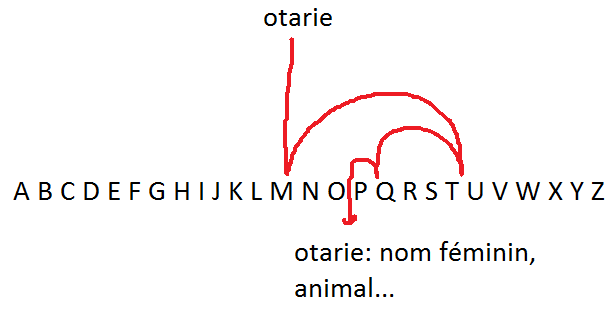

.. index:: solution, algorithme, tri, Dunkerque 2015-03-25

.. _l-algo_tri_sol:

Tri (solution)
==============

L'idée derrière ces petits exercices est de montrer qu'il n'existe qu'un seul moyen
fiable pour retrouver les deux ou trois cartes manquantes, c'est de trier
le paquet. C'est ensuite très facile puisqu'on détecte rapidement
les deux cases qui ont disparues.

C'est encore plus rapide si le paquet de cartes étaient déjà trié. 
Il suffit de parcourir toutes les cartes jusqu'à repérer les deux vides
qu'elles ont laissées.

Comment trier ?

La plupart des gens ont le bon réflexe : séparer les cartes par couleurs,
trier chaque couleur. Ca tombe bien, on est plusieurs. Ensuite les deux cartes manquantes
sont vite repérées.

Méthode systématique de tri
---------------------------

.. _s-tri_bulle_sole:

Avec mille carte, c'est plus difficile. Le premier tri proposé correspond aux tri à bulles.
Pour comprendre, il faut s'intéresser à la carte la plus haute.

Les cartes jouent à saute-mouton. Les petites passent en dessous, les plus grandes au-dessus.
Au final, tout le monde finit par trouver sa place.

Une illustration de ce tri sous Scratch est 
décrite au paragraphe :ref:`l-prog_tri`
et sa solution :ref:`l-prog_tri_sol`.

**construire un arbre pour trier**

On remet à tous les enfants sauf un  une carte et deux fils de laine : un rouge, un bleu.

* Le premier enfant choisi aléatoirement se place au milieu de la pièce.
* Le second enfant compare sa carte avec le premier. Si sa carte est
  plus petite, il s'accroche au fil rouge. Si elle est plus grande, il
  s'accroche au fil bleu.
* Le troisième enfant compare sa carte au premier. Si elle est plus petite,
  il s'accroche au fil rouge, si le fil rouge est déjà pris, il compare sa carte
  à celle de l'enfant au bout du fil. Il s'accroche dès qu'il trouve une place libre.

Pour ramasser les cartes, il suffit de marcher tout autour de l'arbre :

Les numéros oranges désigne les moments où on prend la carte des mains
de celui qui la tient
pour la mettre à la suite des autres.
C'est-à-dire qu'au moment où celui qui ramasse la carte d'enfant dans l'arbre, 
il a dans la main toutes les cartes qui dépendent du fil rouge et il n'a pas encore
toutes les celles qui dépendent du fil bleu.

*Pourquoi ça marche ?*

C'est dû à la façon de construire l'arbre. On prend toujours bien soin d'ajouter un nombre
plus petit à un fil rouge, un nombre plus grand à un fil bleu. 
Imaginons maintenant que les fils rouges sont des escaliers qui descendent,
les fils bleus des escaliers qui montent.
Pour commencer, 
il suffit de suivre tous les fils rouges pour trouver le plus petit élément : on a fait que descendre.
On remonte pour prendre le chiffre le palier, puis on monte pour prendre la suite et ainsi
de suite jusqu'à ce qu'on soit arrivé au bout de tous les escaliers.

**couper, trier, fusionner**

Lorsqu'on est plusieurs ou qu'on doit trier un grand nombre de cartes,
il est plus simple de trier des petits bouts puis de les assembler.
Par exemple, pour une bibliothèque, on trie tous les A puis tous les B
pour n'en faire qu'une seule pile.

Mais si découpe sans se préoccuper de la première lettre, on trie deux
paquets de livres chacun de leur côté et on les regroupe ensuite. 
Les deux paquets vont s'entremêler sans changer d'ordre, comme deux peignes.
Vous voyez des flèches qui se croisent ?

Si on est deux et que chacun à un paquet de mots (ou de cartes),
on sait que la carte suivante dans le paquet trié 
est forcément l'une des deux sur le haut du paquet.

Ordre alphabétique
------------------

Quand on cherche un mot, bin souvent, on ouvre le dictionnaire au milieu. On coupe en deux.
On va avant si le mot qu'on cherche est avant ou après s'il est après. Mais pour aller
plus vite, on avance de beaucoup pages d'un coup... On coupe encore en deux et encore en deux
en faisant à chaque des pas de plus en plus petits.

Sans le savoir, on utilise un algorithme de `recherche dichotomique <http://fr.wikipedia.org/wiki/Dichotomie>`_.
A chaque qu'on coupe en deux, on élimine la moitié des pages dans lesquelles il faut chercher.
C'est pour ça que même si un dictionnaire contient beaucoup de pages,
on trouve quand même très vite les mots.

Et vous pourrez compter... d'après l'algorithme, si le dictionnaire a deux milles pages, il vous 
faudra au plus ouvrir 11 pages pour trouver la bonne (car 2000 divisé par 2 et encore par 2
et encore par 2 ... comme ça 11 fois de suite, ça finit par faire plus petit que 1).

Autres tris
-----------

Il existe de nombreuses autres façons de trier. L'article
`A small video on sorting algorithm <http://www.xavierdupre.fr/blog/2014-04-04_nojs.html>`_
montre une vidéo illustrant ces différentes façons. Même si on connaît le coût de l'algorithme
optimal, c'est vrai dans le cas général. Dans un cas particulier, il existe parfois
des astuces qui permettent de trier plus rapidement car on en sait un peu plus sur les 
éléments à trier. C'est ce qu'on fait quand on trie les cartes : d'abord par couleur puis par numéro.

A quoi ça sert ?
----------------

Dans une gare, le tableau d'affiche affiche les trains par ordre d'heure de départ (ou d'arrivée).

Dans des livres, les index, les tables des matières, tout se fait par ordre alphabétique.

Dans votre téléphone, les numéros de vos amis sont forcément rangés dans un ordre précis
sinon vous passeriez en temps fou à les chercher.

Dans votre cuisine, les couverts sont généralement triés, c'est plus pratique pour 
prendre une fourchette ou un couteau. Les assiettes, les plats, tout est rangé.

Et le linge est parfois trié pour éviter que le blanc ne le soit plus.

Le `tableau de Mendeleïev <http://fr.wikipedia.org/wiki/Dmitri_Mendele%C3%AFev>`_ range les atomes
dans un tableau qui permet de répérer leurs similitudes.

A quoi ça sert de ranger sa chambre ?

