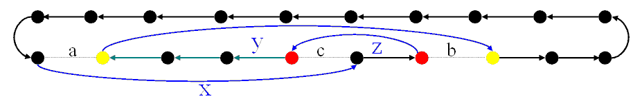

.. issue.

.. index:: voyageur de commerce, solution, distance, algorithme, parcours, circuit, tsp

.. _l-algo_tsp_sol:

Le voyageur de commerce (solution)
==================================

**Q1 :** 

Le bouteille de départ n'est pas importante puisqu'il s'agit de faire le tour.
On peut donc démarrer de n'importe quelle bouteille, ce sera toujours le même tour.

.. image:: tsp_tour.png
    :width: 600 px

Le premier réflexe est de relier les bouteilles en allant d'une bouteille à
l'autre en prenant la plus proche. Mais c'est un peu trop compter sur la chance
et la méthode est un peu trop aléatoire. Une meilleure méthode est
d'entourée les points à visiter par une corde :

Puis on se rapproche le plus possible en tirant sur le fil :

.. index:: enveloppe convexe

On obtient l'`enveloppe convexe <http://fr.wikipedia.org/wiki/Enveloppe_convexe>`_.
Ensuite, pour chaque point à l'intérieur, on tire un peu plus le fil là
où cela paraît le plus court :

On fait pareil avec les autres points intérieurs :

Comment écrire l'algorithme ?

#. Constuire l'enveloppe convexe de l'ensemble des points. 
   Ce sera le chemin initial.
#. Pour chaque point à l'intérieur, considérer le point le plus 
   proche d'un des segments.
#. Ajouter ce point à ce segment.
#. Retourner à l'étape 2.

Le problème est que construire l'enveloppe convexe d'un ensemble 
de points n'est pas aussi simple que ça en a l'air.
Ce fera l'objet d'un algorithme particulier.
C'est d'ailleurs pourquoi on regarde les d'autres algorithmes
permettant de construire le chemin le plus court passant par toutes 
les villes. Pour le savoir, il vous suffit de lire ce qui suit.
   

Autres options à programmer
---------------------------

**Q2 :** 

Regardons sur la figure suivante :

Avec le chemin rouge qui se croise, on parcourt : Lyon, Paris, Strasbourg, Nantes.
Avec le chemin bleu qui ne se croise pas, on parcourt : Lyon, Strasbourg, Paris, Nantes.
Les points de départ et d'arrivée sont les mêmes. On a juste permuter 
Strasbourg et Paris.

Pourquoi c'est plus court de ne pas croiser ?

Le parcours rouge est de même longueur que : Lyon, **C**, Strasbourg, Paris, **C**, Nantes
qui parcourt les villes dans le même ordre que le parcours bleu.
Sauf que aller de Lyon à Strasbourg en passant **C** est plus long que d'y aller
directement : c'est un détour. Donc, il suffit de ne pas passer par C. C'est plus court.

.. image:: tsp_tour1.png
    :width: 600 px

**Q3 :** 

Quel est le chemin de plus court, le rouge ou le bleu ? Vaut-il mieux
faire ``ABC`` ou ``BAC`` ?

La différence entre les deux parcours ? On a permuté les villes ``A`` et ``B``. 
Peut-on faire pareil avec les points ``IJK`` ? La réponse est oui.
Par extension, si on a déjà tracé un chemin qui passe par toutes les villes,
on peut permuter deux villes consécutives et voir si cela raccourcit le chemin.
Par exemple, on peut essayer de permuter n'importe quelle ville avec n'importe
quelle autre. On peut imaginer à peu près n'importe quelle transformation à 
partir de là.

Le notebook :ref:`voyageurdecommercerst` permet d'avoir un cadre dans lequel
ses propres algorithmes.

Pour aller plus loin
--------------------

On rappelle le problème...

On considère un problème un petit peu différent. Pour recevoir des amis, il faut faire les courses en ville 
et à pied. Il faut du pain (500 grammes), des pommes de terre (3 kg), du fromage (2 kg), 
du vin (2 kg) et de la viande (1 kg). 
Il faut donc aller à la boulangerie, chez le marchant de légumes, le fromager, le marchand de vin
et le boucher. On suppose que ce sont les commerçants de votre ville.
Dans quel sens faut-il faire les courses pour porter le moins possible ?

La solution complète attendra un peu. Mais en attendant voici deux indices sous forme 
de questions :

#. Au début du chemin, combien de kilos porte celui qui fait les courses ? Et à la fin ?
#. Comment comparer deux chemins ? 
    
    
