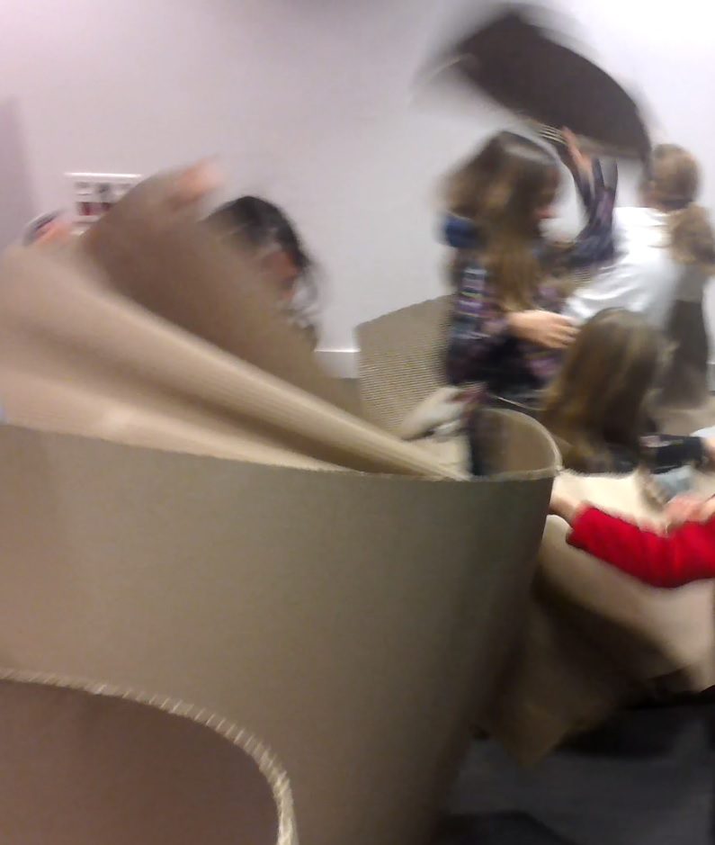

.. _l-session_2018_01_13:

Lille - Devoxx4Kid - 13 janvier 2018
====================================

`EuraTechnologies <https://www.euratechnologies.com/agenda/programmation-robotique-ingenierie/>`_,
invité par `Coding & Bricks <https://www.codingandbricks.com/>`_.

Trois groupes se sont succédés, chacun une heure
pour deux mini ateliers, le premier sur une astuce
algorithmique, le second sur du montage vidéo avec
de la programmation.

.. contents::
    :local:

Le labyrinthe
+++++++++++++

Le labyrinthe était sans doute trop petit pour que tout le
monde saisisse bien la petite difficulté que j'ai voulu mettre
en évident avec cet atelier qui se déroulait dans un labyrinthe
tracé avec un rouleau de 30 mètres de carton découpés en quelques
tronçons.

.. video:: images/rapide.mp4
    :width: 400

Un labyrinthe beaucoup plus grand, des murs plus haut,
auraient sans doute sollicité un peu plus l'imagination
car il serait devenu impossible de voir le chemin menant
vers la sortie depuis l'entrée. Plus en détail :
:ref:`l-algo_labyrinthe`.

Pour la petite histoire, tracer un labyrinthe avec un rouleau
de carton est un problème intéressant quand si on considère
que cela doit être fait avec le moins de coupures possibles
et des cloisons qui ne sont jamais doublées. Et la solution
à ce problème est décrite dans :ref:`l-algo_facteur_chinois`.

Le montage vidéo
++++++++++++++++

Découper, coller tout en programmant avec :epkg:`Python`,
réaliser ses premiers trucages vidéo en quelques lignes de
code. Il n'est pas si évident que cela de traverser les murs
mais c'est toujours plus facile en film.

::

    from code_beatrix.faq.faq_video import *
    extrait1 = video_extract_video('video_mur.mp4', '00:00:06', '00:00:09')
    extrait2 = video_extract_video('video_mur.mp4', '00:00:16', '00:00:19')
    assemblage = video_concatenate([extrait1, extrait2])
    video_save(assemblage, 'mur.mp4', verbose=True)

.. video:: images/mur.mp4
    :width: 400

Le notebook qui a servi d'exemple :ref:`exemplevideodevoxx2018rst`.
La suite ici... :ref:`l-montage_video`.
Le dernier groupe a eu la lourde tâche de détruire
de labyrinthe et ils s'y sont donnés à coeur joie.

Une heure était assurément trop court pour appréhender
les outils mais quelques-uns ont su adapter un montage
donné comme premier exemple.

Livres, Bibliographie
+++++++++++++++++++++

* :ref:`l-biblio_algo` à propos des algorithmes
* :ref:`l-biblio_art` à propos des médias
